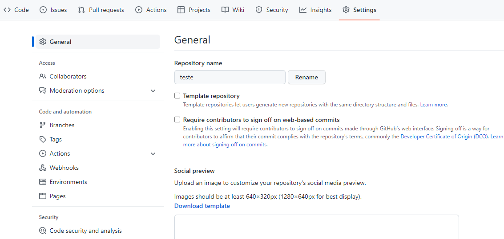
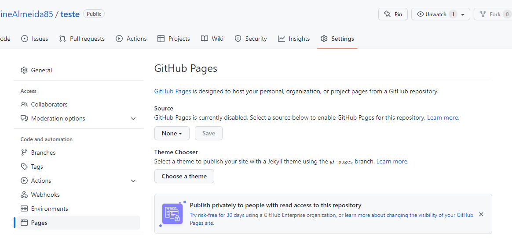
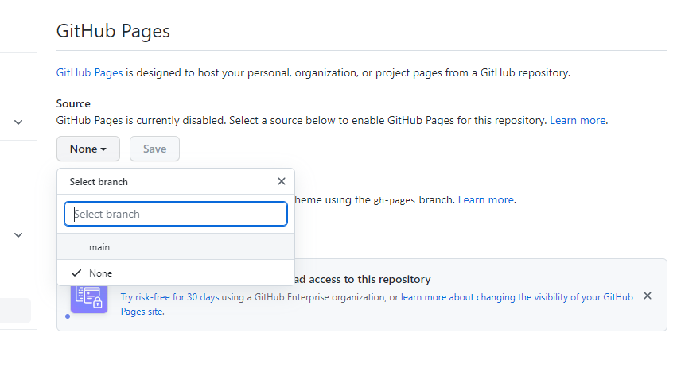

## ✔️ `Disponibilizar` um projeto numa página no `GitHub`
___

#### Agora vamos aprender uma outra coisinha muito útil
#### Se voce criou um portfólio por exemplo, voce tem como disponibilizá-lo no `GitHub` numa página para que fique fácil acessar o projeto, para mostrar como faremos, vou usar o projeto de teste que criei.
#### No `GitHub`, depois de subir o seu projeto, tem um menu em cima, clique em `Settings`:

  

#### Voce será direcionado para esta página, e perceba que tem umas opções no menu á esquerda, clique em `Pages`:
#### Voce verá esta página:

  

#### Aqui é simples, em `Source`, existe um botão com o nome de `None`, clique nele e perceba que existem duas opções: `main` e `None`, que é a que está selecionada, troque para a opção `main` e em seguida clique no botão `Save`

  

#### a página irá atualizar e, será disponilizado um link, copie ele e cole num navegador

  

#### Prontinho!! Seu projeto está acessível numa página

  

**Lembrando que para que isso seja possível, o arquivo `index` deve estar dentro da pasta do repositório e não em sub-pastas, pois quando selecionamos a opção `main`, o `GitHub` vai buscar pelo arquivo `index` para exibir o conteúdo e se esse arquivo não estiver no local correto não terá visibilidade, se tornando uma página sem conteúdo.**
