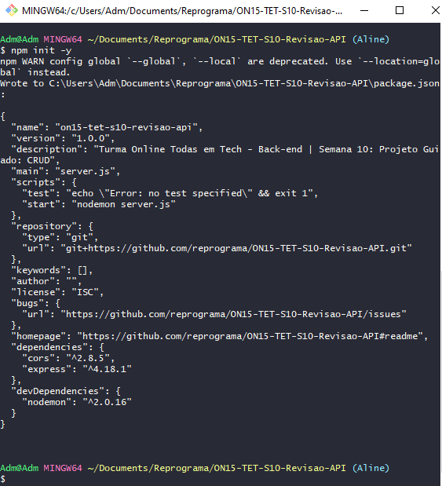
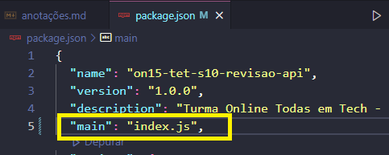
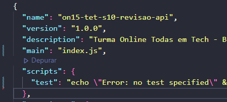
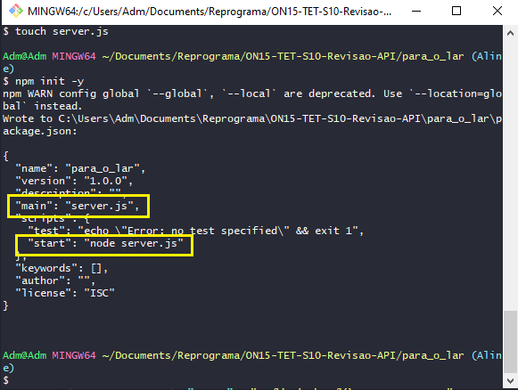
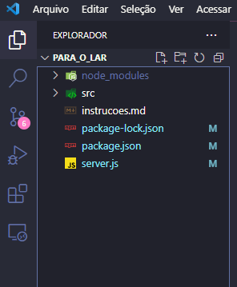
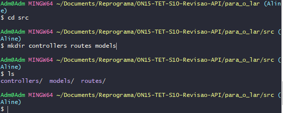
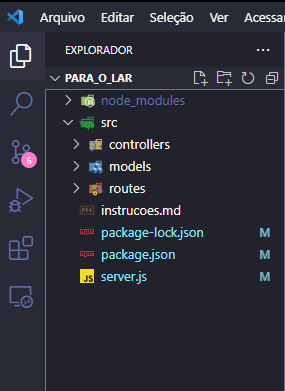
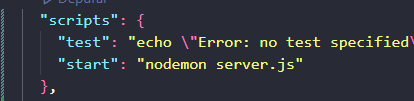
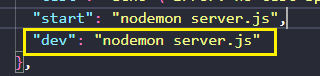

## ✔️ `Revisão Detalhada da Aula 1`
___


#### Montar um projeto utilizando a `Arquitetura MVC`
#### Iniciando um servidor:
```git
    npm init -y
```
#### Esse comando significa que estou dando um `"yes"` pra tudo, ou seja, o git aceita por mim ao invés de eu ficar fazendo um a um como fizemos em outra aula.
<p align="center">
  
</p>

#### Aparecerá assim no seu terminal. Se abrirmos o arquivo `package.json`
<p align="center">
  
</p>

#### Quando `não` criamos o arquivo `server.js`, o arquivo `main`, ou seja, a entrada para a minha `API` será o `index.js` como aparece na foto acima, porque por default no `JavaScript` será sempre a `index.js`. isso é muito importante, então sempre se atentar a olhar para qual arquivo o `JavaScript` está apontando como entrada. Nesse mesmo arquivo podemos notar também que não vem o `start`.
<p align="center">
  
</p>

#### Ou seja, não tem como iniciar nossa aplicação. Então vamos deletar o arquivo `package.json` e usar o comando:
```git
    touch server.js
```
#### Para criar o arquivo, e após isso vamos usar o comando:
```git
    npm init -y
```
#### Se voce olhar no terminal o que aconteceu... 
<p align="center">
  
</p>

#### Tanto na `main` quanto no `start` ja foi reconhecido o arquivo que eu criei... o `server.js` como entrada da minha aplicação. Então essa é a forma orreta de se iniciar um projeto. Mesmo que o arquivo `package.json` seja editável, ou seja, posso alterar os dados quando necessário, dessa forma não corremos o risco de esquecer de fazer manualmente.
#### Para seguir para o próximo passo temos três opções: criar ja toda a `Estrutura MVC`, criar as `configurações do server.js` ou `Instalar as Dependências`. Sabemos bem que a ordem dos fatores não altera o produto final, então... vamos primeiro `Instalar as Dependências` e a primeira delas é o express.
```git
    npm i express
```
#### Com isso feito ja sabemos que foi criado o arquivo `package-lock.json` e a `node_modules`. Podemos ja instalar o cors também:
```git
    npm i cors
```
#### Podemos instalar todas as dependências com um só comando:
```bash
    npm i cors nodemon
```
#### Mas recomendo fazer a instalação de um a um ou, no máximo dois em dois para não esquecer nada. Agora vamos instalar o nodemon para desenvolvimento, pois acima foi só um exemplo de como instalar dois de uma vez, seguimos:
#### Forma nova ou:
```git
    npm i -D nodemon
```
#### Forma antiga:
```git
    npm i nodemon --save-dev
```
**O nodemon não deve ser considerado como uma dependência do projeto e sim uma dependência para desenvolvimento, uma vez que só usamos ele para iniciar nosso servidor e nada mais.**
#### Agora vamos criar a pasta `src`:
```git
    mkdir src
```
#### Até aqui nosso projeto está assim:
<p align="center">
  
</p>

#### Podemos agora criar o `.gitignore`:
```git
    touch .gitignore
```
#### Para incluir nele a `node_modules`. Podemos também abrir essa página [samples/.gitignore at master - GitHub](https://github.com/box/samples/blob/master/.gitignore) pois nela ja tem tudo o que precisaremos ignorar ao longo da construção do nosso projeto, sem correr o risco de subir para o `GitHub` algo desnecessário. Feito isso vamos entrar dentro da pasta `src`:
```git
    cd src
```
#### Para criar as outras 3 pastas padrões: a `controller`, a `routes` e a `models`:
```git
    mkdir controllers routes models
```
<p align="center">
  
</p>

#### Agora nosso projeto está assim:
<p align="center">
  
</p>

#### Vamos então criar nosso arquivo `app.js` que será onde vai ficar a nossa aplicação:
```git
    touch app.js
```
#### Agora... como ja instalamos o nodemon, vamos usar ele: no arquivo `package.json`, no `start` vamos incluir o `nodemon` lá:
<p align="center">
  
</p>

#### Uma observação:
**Se voce quiser i=usar o nodemon para desenvolvimento, voce pode configurar o start assim:**
```javascript
    "dev": "nodemon server.js"
```
<p align="center">
  
</p>

#### Qual a diferença? 
```javascript
    "start": "nodemon server.js" 
```
#### Deixa a aplicação mais leve pois é para produção enquanto o:
```javascript
    "dev": "nodemon server.js" 
```
#### Que é pra desenvolvimento fica mais pesado
#### E pra rodar seria assim:
```git
    npm run dev
```
#### Para desenvolvimento ou:
```git
    npm run start
```
#### Para produção.
#### Quando voce estiver trabalhando... é `obrigatório` usar o `dev`, mas como estamos aprendendo, vamos usar o `start` mesmo. 
#### `Conhecimento`: a nivel de estudo, primeiro montamos a `API` pra depois conectar ao banco, no mundo real começamos pelo banco e depois vamos construindo a `API`.
