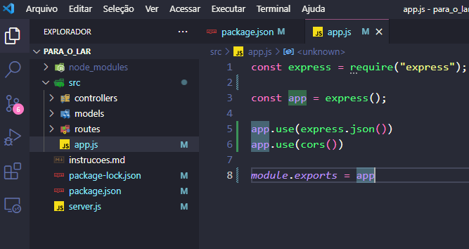
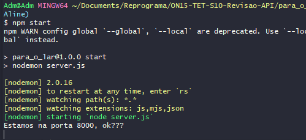
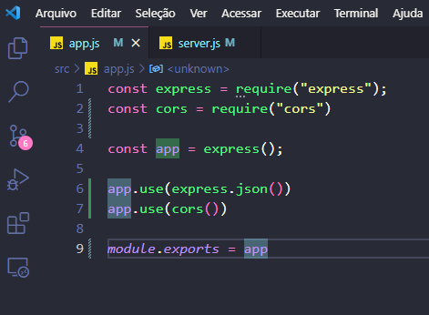
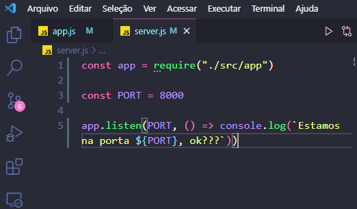

## ✔️ `Revisão Detalhada da Aula 2`
___


#### Agora vamos começar pela `API`, o arquivo `app.js` `criando uma variável para requerir (importar) o express`:
```javascript
const express = require("express");
```
#### Agora vamos `chamar o express` e o `cors` criando uma outra variável para chamar ele como função:
```javascript
const app = express();
```
#### E:
```javascript
const cors = require("cors")
```
#### Se fosse pra criar uma conexão com o anco de dados, seria exatamente aqui... na trceira linha do código, pois se tiver algo errado daqui em diante, o código ia quebrar aqui, antes de toda a lógica. Então sempre chamamos o express e na sequência ja criamos a conexão com o banco, mas como nesta aula vamos usar um arquivo.json pra simular o banco não veremos isso. Um banco de dados é um serviço externo, então faz sentido conectarmos a ele primeiro pra depois construir a lógica.
#### Vamos então fazer as configurações da API:
```javascript
app.use(express.json())
```
#### Esse `.use` significa que voce esta inserindo uma configuração ou um recurso externo (a `rota`), ou uma outra aplicação., Em seguida, vamos usaro cors:
```javascript
app.use(cors())
```
#### E vamos então exportar (deixar pública) a nossa `API`:
```javascript
module.exports = app
```
#### E, por enquanto, nosso código nesse arquivo (`app.js`) está assim: 
<p align="center">
  
</p>

#### E agora, por fim, vamos trabalhar no `server.js`. Vamos requerir nossa app para esse arquivo:
```javascript
const app = require("./src/app")
```
#### Agora vamos configurar a porta criando uma variável para receber a porta:
```javascript
const PORT = process.env.PORT
```
#### o `process.env.PORT`é uma variável de ambiente que vai pegar a porta do Node.Js que esta em processo na nossa máquina, ou podemos definir ela manualmente, que é como fizemos nas aulas anteriores:
```javascript
const PORT = 8000
```
#### Pra `Back-End`, geralmente usamos as portas a partir de `8000`, e pra `Front-End` usamos a partir do `3000`. e por fim vamos colocar nosso servidor para ouvir a nossa porta:
```javascript
app.listen()
```
#### E qual o primeiro parâmetro? A PORT, seguido de um callback com um conlose.log pra se conectar, aparecer a mensagem do console:
```javascript
app.listen(PORT, () => console.log(`Estamos na porta ${PORT}, ok???`))
```
#### Agora vamos testar a conexão do servidor:
```git
npm start
```
#### E... olhando no terminal:
<p align="center">
  
</p>

#### Esta rodando nosso servidor! Agora vamos ver como estão os códigos dos nossos arquivos até aqui... o `app.js`:
<p align="center">
  
</p>

#### E o `server.js`:
<p align="center">
  
</p>

#### Vamos criar um arquivo para `routes`, chamado `livroRotas.js` e vamos também ja criar o arquivo da `controller` chamado `livroController.js` e ja vamos começar por ele. Vamos começar com o método GET, mas antes vamos criar uma cariável que vai receber o arquivo.json que vamos usar:
```javascript
const livrosModel = require("../models/livrosModel.json")
```
#### Beleza até aqui! Agora vamos revisar novamente.
___
**ORDEM DE CONSTRUÇÃO DE API**
1. `app.js` - faz o arquivo e cria as configurações
2. `server.js` - cria as configurações
3. `models` - cria ela
4. `controllers` - cria ela
5. `routes` - chama ela
6. `app.js` - chama ele

### `server.js`
___
```javascript
    const app = require("./src/app") # 1

    const PORT = 8000 # 2

    app.listen(PORT, () => console.log(`Estamos na porta ${PORT}, ok???`)) # 3
```
1. Importa a nossa api em express, porque nossa api fica dentro do src
2. Definimos uma porta para o nosso servidor escutar
3. Chamamos nosso `app`
    -  1° parâmetro - `listen` => escutar : deixamos nossa api exposta no nosso servidor passando a porta`(PORT`.
    -  2° parâmetro - `, () => )` : com o callback podemos fazer o que quisermos e nesse caso apenas imprimimos um console.log para ter a certeza que o servidor está rodando.
___
#### Voltando ao código vamos então para o arquivo `livroController.js` para criar uma função para buscar todos os livros, e pra fazer sentido... o nome da nossa função será `allFindEbooks` que significa procurar todos os livros, é muito importante definirmos métodos explícitos para que fique claro o entendimento dele, essa variável vai receber uma `request` e uma `response` acompanhado de uma `callback` para definirmos a ação e pronto... ja montamos a estrutura básica:
```javascript
    const allFindEbooks = (request, response) => {
        
    }
```
#### Agora vamos criar a `response` com o `status(200)` seguido do arquivo json com uma mensagem:
```javascript
    const allFindEbooks = (request, response) => {
        response.status(200).json({
            "Mensagem": "Retornando todos os Livros",
            "Livros": livrosModel
        })
    }
```
___
## `Conhecimento:`
####  Seguido do status podemos ter:
- response.status().`send`() => vai enviar qualquer coisa que voce quiser (arquivo, mensagem... )
- response.status().`render`() => s estivermos trabalhando com view, seria o html que iria aqui
- response.status().`json`() => uma coleção de dados que está num arquivo .json

#### Depois do escolhido acima, sempre teremos um parênteses() e na sequencia... vai depender que que voce quer retornar, então se o json começa com:
- `[]` -> coleção de dados = vários recursos => `uma lista de livros`
- `{}` -> dados = um recurso => `um livro`
___
#### Continuando nosso projeto, agora vamos exportar a função criada:
```javascript
    module.exports = {
        allFindEbooks
    }
```
#### Agora vamos voltar no arquivo da routes, o `livroRotas.js` pois ja temos um endPoint (que é a `rota`) e estamos exportando ele, agora temos que testar. Aqui precisamos da dependência... o `express`:
```javascript
    const express = require("express")
```
#### E agora criar nossa rota:
```javascript
    const router = express.Router()
```
#### Agora vamos importar a nossa controller:
~~~javascript
    const controller = require("../controllers/livroController")
~~~
___
#### `Conhecimento:`
#### Navegando entre as pastas do projeto:
#### `../` -> navega um diretório(pasta) acima (atrás)
#### `./` -> navega um diretório(pasta) para baixo(frente)
#### `Conhecimento:`
#### E no Back-End usamos o `require`para importar algo
#### No Front-End usamos o `import`.
___

#### Agora faremos o `GET`.
```javascript
    router.get("/", controller.allFindEbooks)
```
#### E vamos exportá-la:
```javacript
    module.exports = router
```
#### E agora importá-la no `app.js`:
```javascript
    const livroRotas = require("./routes/livroRotas")
```
#### E agora vamos usá-lo:
~~~javascript
    app.use("/livros", livrosRotas)
~~~
#### Está criado nosso método `GET`.

