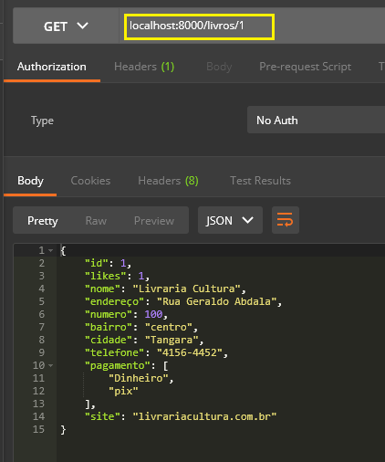
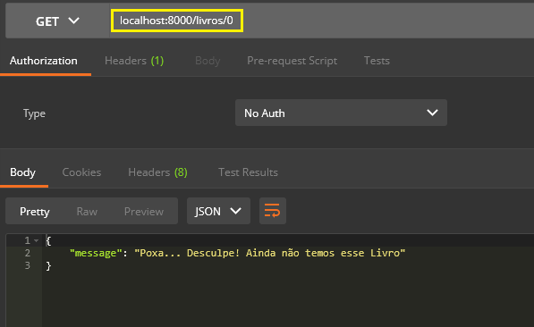
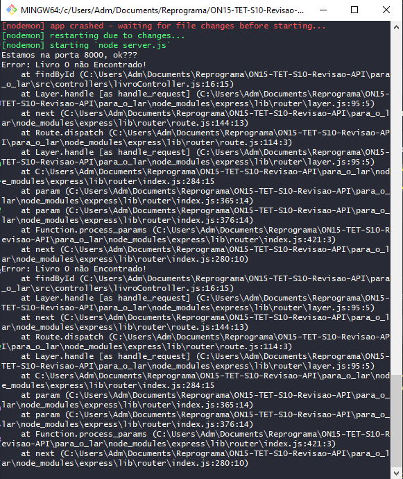

## ✔️ `Revisão Detalhada da Aula 2`
___


#### Vamos agora fazer o próximo. Vamos criar uma variável que será `findById` que receberá uma `request` e uma `response`. Pronto!:
```javascript
    const findById = (request, response) => {

}
```
#### Já que vamos procurar por id, vamos pegar esse id criando uma variável para receber esse id:
```javascript
    const id = request.params.id
```
#### E dizer que noso livro encontrado é igual ao id do livrosModel que no caso é o nosso arquivo .json que contén nossos livros, essa é uma pesquisa simples e mais para somente números no id:
```javascript
    const findEbook = livrosModel[id]
```
#### Ou podemos também usar o find:
```javascript
    const findEbook = livrosModel.find(livro => livro.id == id)
```
#### Pois para cada livro que temos, teremos um id do livro que será igual ao id requisitado, essa é uma pesquisa sofisticada. Qualquer um dos dois é válido, mas vamos usar o mais sofisticado nesse caso. Agora precisamos fazer uma verificação usando o `if/else`: se o livro não existe `if(!findEbook)`vai retornar uma response com o status 404  seguida de uma mensagem return `response.status(404).json({"Mensagem": "Livro não Encontrado!"})`:
```javascript
    if(!findEbook) {
        throw new Error (`Desculpe... ! Livro ${id} não Encontrado!`)
            
        }
```
#### ou... fazer o `try/catch`:
```javascript
    try {
    const findEbook = livrosModel.find(livro => livro.id == id)
    if(!findEbook) {
        throw new Error (`Livro ${id} não Encontrado!`)            
        }
    } catch (error) {

    }
```
#### Nesse caso, o `throw` cria uma `Exception` ou `Error`, e o que é isso? Algo que não deveria acontecer, se eu tenho um endPoint de um livro e ele não tem esse livro aconteceu uma `Exception`, uma `exceção` ou um `erro`. E o `throw` vai indicar para o `Node.js` que aconteceu algo que não deveria e sua `API` vai quebrar, e quando ele vai quebrar a `API`, o catch vai e captura esse erro. O `new` uma palavra reservada do `Javascript` que instancia um objeto a partir de uma classe. Pensando no `new Error` ele cria um objeto que no caso é a mensagem `(Livro ${id} não Encontrado!)`.
#### Antes do `catch` podemos criar nossa response:
```javascript
    response.status(200).json(findEbook)
```
#### É sempre bom ter dois tipos de respostas: a do client (o cliente final) que no caso é `(Livro ${id} não Encontrado!)` e a técnica que é a do status. e agora vamos fazer o erro de fato. Por que tratar um erro? Quando temos um erro, como desenvolvedoras temos 3 opções:
- Deixar a API quebrar.
- Tratar o erro.
- Ou subimos o erro.
#### Neste caso vamos tratar esse erro. 
```javascript
 response.status(404).json({
            message: error.message
        })
```
#### Por que `error.message`? Porque nesse trecho de código `throw new Error`, esse `Error` vai retornar pra gente um objeto que vai ter a chave `menssage` que será a mensagem que passamos anteriormente. E nosso código está assim agora:
```javascript
    const findById = (request, response) => {
    const id = request.params.id

try {
    const findEbook = livrosModel.find(livro => livro.id == id)
    if(!findEbook) {
        throw new Error (`Livro ${id} não Encontrado!`)            
        }
    response.status(200).json(findEbook)
    } catch (error) {
        console.error(error)
        response.status(404).json({
            message: "Poxa... Desculpe! Ainda não temos esse Livro",
            details: error.mensage
        })
    }
}
```
#### A `message`: É uma mensagem bonitinha. A `details` é a mensagem técnica. E por que o `console.error(error)`? Porque voce precisa saber o porque que o código está quebrando, podemos transformar iso em estatística. Agora vamos expostar essa função:
```javascript
    module.exports = {
        allFindEbooks,
        findById
    }
```
#### E agora vamos nas rotas criar um `endPoint` para obter um livro, `router.get`, nesse caso não teremos um path, ele será vazio e vamos apenas definir o endPoint que nesse caso será o id `("/{id}")`.
```javascript
    router.get("/:id")
```
#### E agora vamos chamar a função:
```javascript
    router.get("/:id", controller.findById)
```
#### Agora vamos no `Postman` testar, nesse caso busquei pelo `id 1`:
<p align="center">
  
</p>

#### E foi exatamente ele que apareceu, ou seja, está funcionando ossa nova rota. Agora vamos buscar por um `id` que não exista, o `0`:
<p align="center">
  
</p>

#### Ele mostrou o erro que configuramos. Se voce for no terminal, ele vai mostrar a linha de código que quebrou...
<p align="center">
  
</p>

#### E se voce clicar na linha de erro, ele te mostra no VSCode onde está essa linha que quebrou.


