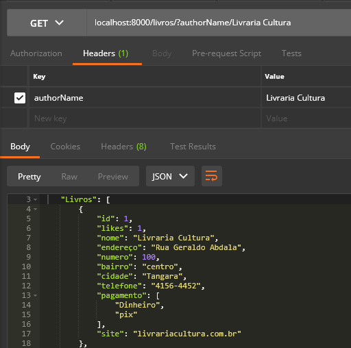

## ✔️ `Revisão Detalhada da Aula 4`
___


#### Agora vamos para a próxima função criando uma variável `findByAutorName` tendo uma request e uma response e como vamos pesquisar por nome de autor, teremos que criar uma constante para receber da query o author procurado e essa variável ficará dentro de chaves porque vai extrair do arquivo json:
```javascript
const findOneByAuthorName = (req, res) => {
    const { authorName } = req.query
}
```
#### Agora vamos fazer a nossa verificação: se a busca for vazia `if(!authorName)`, aparecerá um erro:
```javascript
const findOneByAuthorName = (req, res) => {
    const { authorName } = req.query

    try{
        if(!authorName) throw new Error("Nenhum parametro inserido para realizar a busca!")
    } catch (error) {
        
    }
}
```
#### Agora vamos fazer a segunda lógica, que é caso encontrar:
```javascript
    const findEbook = livrosModel.find(currentEbook => currentEbook.nome == authorName)
```
#### Queremos encontrar pelo nome do autor e agora vamos colocar o erro:
```javascript
    if(!findEbook) throw new Error (`Autor ${authorName} não Encontrado!`) 
```
#### Que nesse caso é o mesmo erro que fizemos anteriormente, agora vamos fazer a response:
```javascript
    res.status(200).json(findEbook)
```
####  agora vamos para o erro:
```javascript
    } catch (error) {
        console.error(error)
        res.status(404).json({
            "message": "Desculpe, ainda não temos livros desse Autor!",
            "details": error.mensage
        })
```
#### Agora vamos exportar a função:
```javascript
    module.exports = {
    allFindEbooks,
    findById,
    findOneByAuthorName
}
```
#### Agora vamos para a rota:
```javascript
    router.get("/", controller.findOneByAuthorName)
```
#### Vamos então no Postman testar:
<p align="center">
  
</p>

#### Ele retornou pelo nome.
