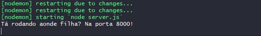
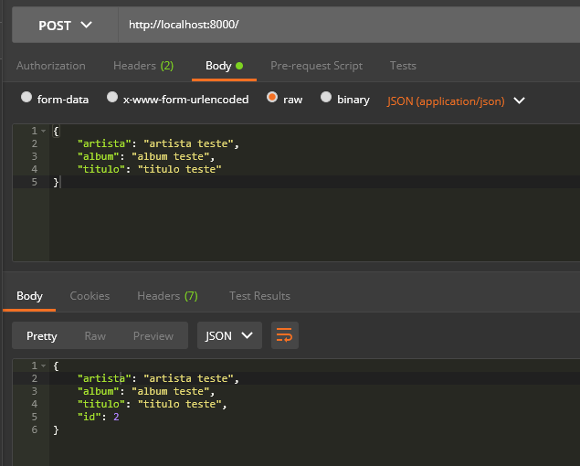
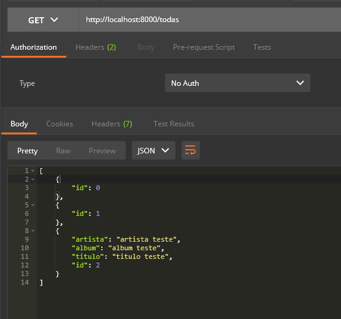

## `Construindo uma API sem MongoDB` ✔️
___


#### Vamos construir uma API sem Mongo. Na pasta raíz, ou pasta principal do seu projeto, digite:
```git
    npm init -y
```
#### Agora vamos criar nossa estrutura de pastas (MVC):
```git
    mkdir src
```
#### A partir dela vamos criar as outras:
```git
    mkdir src/controller src/routes src/model
```
#### Agora vamos criar os arquivos:
```git
    touch server.js src/app.js
```
#### Pronto! Criamos a estrutura MVC básica. Vamos então instalar as dependências do projeto:
```git
    npm i express cors nodemon
```
#### Vamos focar num projeto simples, então vamos montar nossas rotas no arquivo app.js, Ok? Agora avamos requereo o express:
```javascript
    const express = require("express")

    const app = express()

    app.use(express.json())
    
```
#### Agora vamos criar um `POST` de uma música:
```javascript
    app.post("/", (request, response) => {

    })
```
#### Pra buscar uma música preciso de: o artista, o álbum e o nome da música... certo? Pra isso vou criar uma variável pra receber esses dados do body em um objeto:
```javascript
    const { artista, album, titulo } = request.body

    const novaMusica = {
        artista, album, titulo, id:musicaDb.length
    }
```
#### Agora vou criar um "banco que não terá nada dentro:
```javascript
    constmusicaDb = []
```
#### Agora vamos salvar a música no banco:
```javascript
    musicaDb.push(novaMusica)
```
#### E a response:
```javascript
    response.status(201).json(novaMusica)
```
#### Vamos então exportar ela:
```javascript
    module.exports = app
```
#### Vamos agora no arquivo server.js importar a aplicação lá:
```javascript
    const app = require("./src/app")
```
#### Vamos configurar a porta:
```javascript
    const PORT = process.env.PORT
```
#### E 
```javascript
    app.listen(PORT, () => console.log(`ta rodando aonde filha? ${PORT}`))
```
#### Vamos tentar rodar:
```git
    npm start
```
#### Rodou e não rodou,mas vamos agora instalar uma dependência que vai nos ajudar: o dotenv.
```git
    npm i dotenv
```
####  Pra que serve? Permite qu nossa aplicação possa acessar variável de ambiente que está somente na nossa máquina. E como vamos usar? Podemos usá-lo tanto no `server.js` quanto no `app.js` e o `dotenv` tem que ser a primeira coisa que vamos chamar. Então vamos chamar ele no arquivo `app.js`, lá no início do nosso código:
```javascript
    require('dotenv').config()
```
#### A partir de agora vamos configurar a nossa porta pelo `dotenv`, porém ele requer um arquivo chamado `.env`, então vamos criá-lo:
```git
    touch .env
```
#### **Cuidado! Esse arquivo é muito sensível, nele estarão todos os segredos da sua aplicação então não podemos subir esse arquivo para o GitHub, então inclua ele no .gitignore.**
#### No arquivo .env vamos configurar nossa porta:
```javascript
    PORT=8000 
```
#### Somente isso e...
<p align="center">
  
</p>

#### Está rodando na porta que foi configurada. Agora vamos testar no Postman.
<p align="center">
  
</p>

#### Funcionando. Faremos agra um GET:
```javascript
    app.get("/todas", (request, response) => {
    response.status(200).json(musicaDb)
})
```
#### Vamos testar no Postman:
<p align="center">
  
</p>

#### Pronto! 