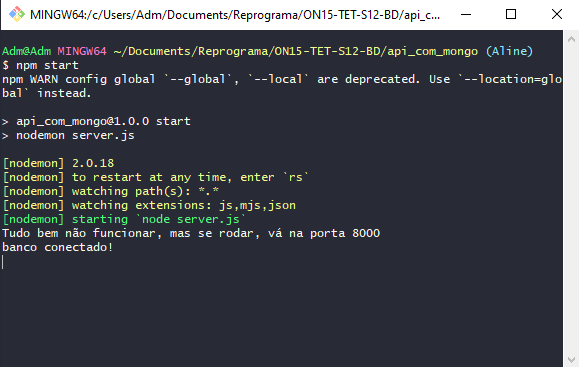
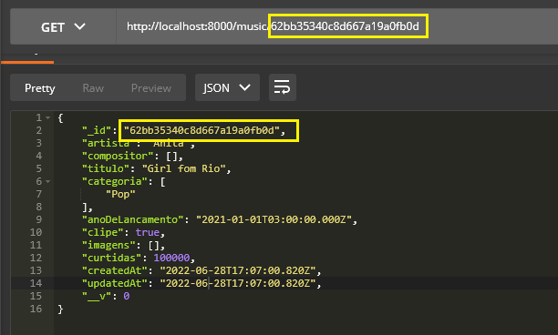

## `Construindo uma API com MongoDB` ✔️
___


#### Procure no google por [MongoDB Atlas](https://www.mongodb.com/cloud/atlas/register?utm_content=rlsapostreg&utm_source=google&utm_campaign=gs_americas_rlsamultirest_search_brand_dsa_atlas_desktop_rlsa_postreg&utm_term=&utm_medium=cpc_paid_search&utm_ad=&utm_ad_campaign_id=14412646452&adgroup=131761126052&gclid=CjwKCAjwquWVBhBrEiwAt1KmwitCZO98A_p6TJXictPvBkQ1-_D5mD1XabJpnnyIuNGEydUK3a1kDxoCeyQQAvD_BwE), faça o registro gratuitamente e crie seu cluster. Com o seu cluster ja criado vamos para o projeto. Já na pasta raíz vamos crir o arquivo server.js:
```git
    touch server.js
```
#### Agora digite:
```git
    npm init -y
```
#### Agora digite:
```git
    touch .env
```
####  e no .env ja vamos configurar nossa porta:
```javascript
    PORT=8000
```
#### E também vamos colocar:
```javascript
    MONGODB_URI=
```
#### Agora vamos no Mongo Atlas, clique na segunda opção:
<p align="center">
  
</p>

#### Aqui... estas opções geralmente sõ selecionadas automaticamente mas... se não tiver, marque-as... exatamente como está aqui.
<p align="center">
  
</p>

#### Agora copie o código que aparece abaixo:
<p align="center">
  
</p>

#### E vamos para o VSCode. Cole esse código assim:
<p align="center">
  
</p>

#### Agora vamos configurar a senha:
<p align="center">
  
</p>

#### Onde eu selecionei, apague e cole a senha assim:
<p align="center">
  
</p>

#### Agora vamos criar nosso banco de dados de fato:
<p align="center">
  
</p>

#### Vamos colocar o nome do nosso banco aqui onde está sublinhado e apagar o resto:
<p align="center">
  
</p>

#### Dei o nome de `reprogramaMusic`. Agora vamos instalar as dependências:
```git
    npm i express

    npm i cors

    npm i dotenv

    npm i mongoose

    npm i -D nodemon
```
#### Feito isso vamos no arquivo server,js requerir tudo o que precisamos:
```javascript
    const express = require("express")
require("dotenv").config()
const cors = require('cors')
const db = require('./database/mongooseConnect')
```
#### Vamos usar:
```javascript
    const app = express()
    app.use(express.json())
    app.use(cors())
```
### E vamos exportar:
```javascript
    module.exports = app
```
#### Agora vamos configurar o arquivo `server.js`:
```javascript
    const app = require('./src/app')

    const PORT = process.env.PORT

    app.listen(PORT, () => console.log(`Tudo bem não funcionar, mas se rodar, vá na porta ${PORT}`))
```
#### Agora vamos rodar o servidor:
```git
npm start
```
#### Pronto! 
<p align="center">
  
</p>

#### Servidor ok. Agora vamos criar uma pasta com o nome de `database`. Ela terá a conexão ao Banco de dados, criamos um arquivo chamado `mongooseConnect.js` e nele vamos criar essa conexão: 
```javascript
    const mongoose = require('mongoose')

    const MONGODB_URI = process.env.MONGODB_URI

    const connect = async () => {
    try {
        await mongoose.connect(MONGODB_URI, {
            useNewUrlParser: true,
            useUnifiedTopology: true
        })
            console.log('banco conectado!')
        } catch(error) {
        console.error(error)
        }
    }

module.exports = { connect }
```
#### Pronto!!! Tudo funcionando!
<p align="center">
  
</p>

#### Terminamos o processo de configuração do banco de dados. A partir da pasta `src` vamos criar a models e um arquivo chamado `musicModel.js`. Nesse arquivo vamos requerir o `mongoose`:
```javascript
  const mongoose = require("mongoose")
```
**Observação:**
**Variáveis com chaves é uma variável que é um objeto.**
#### Exemplo:
```javascript
const novaMusica = {
  artista, album, titulo, id: musicaDb.length
}
```

#### E agora vamos montar o `schema` e pra isso há uma regra importante: o `id` no `mongoose` é sempre com o `underline` na frente:
```javascript
  const MusicSchema = mongoose.Schema({
    _id: mongoose.Types.ObjectId,
    artista: String,
    compositor: [String],
    titulo: String,
    categoria: [String],
    anoDeLancamento: Date,
    clipe: Boolean,
    imagens: [String],
    curtidas: Number
}, { timestamps : true })
```
#### Os que tem os colchetes: `[String]` significa que vai receber um `array` de string. E agora, que usa o nosso schema é a nossa model, então vamos criar:
```javascript
  const Model = mongoose.model("musica", MusicSchema)
```
#### Vamos agora exportar a nossa model:
```javascript
  module.exports = Model
```
#### Ou também podemos ja fazer direto:
```javascript
  module.exports = mongoose.model("musica", MusicSchema)
```
#### As duas formas estão corretas. Agora vamos fazer a nossa `controller`. A partir da `src` crie a pasta `controller` e dentro da pasta criada, crie um arquivo chamado `musicController.js`. E vamos criar nossa primeira função:
```javascript
  const createMusic = async (request, response) => {
    try {
        
    } catch (error) {
        
    }
}
```
#### Agora vamos importar a nossa model:
```javascript
  const MusicModel = require("../models/musicModel")
```
#### Agora vamos criar duas variáveis onde:
```javascript
  const newMusic = new MusicModel(request.body)
  const savedMusic = await newMusic.save()
```
#### A primeira vai receber a nova musica que vier do body e a segunda será a nova música salva. Agora vamos fazer a nossa response:
```javascript
  response.status(201).json(savedMusic)
```
#### Agora vamos fazer a response caso dê erro:
```javascript
  response.status(500).json({ message: error.message })
```
#### Então nosso código todo estará assim:
```javascript
  const MusicModel = require("../models/musicModel")

const createMusic = async (request, response) => {
    try {
        const newMusic = new MusicModel(request.body)
        const savedMusic = await newMusic.save()

        response.status(201).json(savedMusic)
    } catch (error) {
        response.status(500).json({ message: error.message })
    }
}
```
#### Agora vamos exportar:
```javascript
  module.exports = {
    createMusic
}
```
#### Vamos agora criar a pasta `routes` a partir da `src` e criar dentro dela um arquivo chamado `musicRoutes.js`. nele vamos requerir nossa controller:
```javascript
  const controller = require("../controller/musicController")
```
#### Vamos requerir o express:
```javascript
  const express = require("express")
```
#### A nossa router:
```javascript
  const router = express.Router()
```
#### E vamos agora criar uma rota: o POST:
```javascript
  router.post("/music/create", controller.createMusic)
```
####  E vamos exportar a router:
```javascript
  module.exports = router
```
#### Agora vamos para o arquivo `app.js` requerir:
```javascript
  const musicRoutes = require("./routes/musicRoutes")
```
#### Agora vamos usar:
```javascript
  app.use(musicRoutes)
```
#### Agora vamos no `MongoDb` ver:
<p align="center">
  
</p>

#### É só atualizar a página e nosso banco está lá. Agora vamos salvar... abra o Postman e coloque a rota criada `music/create` para criarmos uma música. mas vamos na nossa model para criar a estrutura:

```javascript
  _id: {
            type: mongoose.Types.ObjectId,
            default: mongoose.Types.ObjectId
        },
```
#### Agora nosso schema ficará assim:
```javascript
  const MusicSchema = mongoose.Schema({
        _id: {
            type: mongoose.Types.ObjectId,
            default: mongoose.Types.ObjectId
        },
        artista: String,
        compositor: [String],
        titulo: String,
        categoria: [String],
        anoDeLancamento: Date,
        clipe: Boolean,
        imagens: [String],
        curtidas: Number
    }, { timestamps : true })
```
#### Feito isso se formos no Postman e tentar novamente o POST, olha o que acontece:
<p align="center">
  
</p>

#### O MongoDB vai criar um id.Agora vamos criar de verdade. No Postman monte um exemplo:
```javascript
  {
	"artista": "Anita",
	"titulo": "Girl fom Rio",
	"anoDeLancamento": "2021/01/01",
    "clipe": "true",
    "curtidas": 100000,
    "compositor": [],
    "categoria": ["Pop"],
    "imagens": []
}  
```
#### Agora vamos salvar e...
<p align="center">
  
</p>

#### Foi criado com Sucesso!!!! Porém quando pegamos o que vem do body... concorda que fica feio esteticamente o nosso código?? Então vamos arrumar, no arquivo musicController vamos organizar mais bonitinho:
```javascript
  const {
            artista, titulo, anoDeLancamento, clipe, curtidas, compositor, categoria, imagens
        } = request.body
```
#### Agora nossa controller ficará assim:
```javascript
  const MusicModel = require("../models/musicModel")

    const createMusic = async (request, response) => {
        const {
            artista, titulo, anoDeLancamento, clipe, compositor, categoria, imagens
        } = request.body
        
        try {
            const newMusic = new MusicModel(request.body)
            const savedMusic = await newMusic.save()

            response.status(201).json(savedMusic)
        } catch (error) {
            response.status(500).json({ message: error.message })
        }
}

module.exports = {
    createMusic
}
```
#### Agora vamos criar um `GET`.
```javascript
  const findAllMusic = async(request, response) => {
    try {
        const allMusics = await MusicModel.find()
        response.status(200).json(allMusics)
    } catch (error) {
        response.status(500).json(error)
    }
}
```
#### Vamos exportá-la
```javascript
  module.exports = {
    createMusic,
    findAllMusic
}
```
#### Agora vamos para a rota:
```javascript
   router.get("musics", controller.findAllMusic)
```
#### Feito isso vamos no Postman testar a rota e... :
<p align="center">
  
</p>

#### Retornou tudo o que está no meu banco. Simples assim! Agora vamos criar outro método:
```javascript
  
const findById = async (request, response) => {
    try {
        const findMusic = await MusicModel.findById(request.params.id)
        response.status(200).json(findMusic)
    } catch (error) {
        response.status(500).json({ message: error.message })
    }
}
```
#### Vamos exportar:
```javascript
  
module.exports = {
    createMusic,
    findAllMusic,
    findById
}
```
#### E vamos na routes:
```javascript
  router.get("/music/:id", controller.findById)
```
#### Agora vamos no Postman com um id para testar a rota:
<p align="center">
  
</p>

#### Perceba que o id que eu procurei foi exatamente o que apareceu pra mim. 
