## `Criando um Projeto`
___


#### Vamos iniciar lembrando que nosso projeto possui a arquiterura MVC, então como temos o arquivo package.json, vamos dar o comando:
```git
npm install
```
#### Ja apareceu a node_modules, agora podemos ir para o arquivo `server.js` verificar:
```javascript
    const app = require('./src/app');
    const PORT = process.env.PORT;
    // 3000, 6000, 6060, 8080, 8088

    app.listen(PORT, () => console.log(`Servidor rodando na porta ${PORT}`));
```
#### E... opa...! Nele ja tenho algumas configurações, e ja tenho o `process.env`, então vamos no arquivo `.env` verificar:
**Obs: Se não tiver esse arquivo, crie.**
```javascript
    PORT=8000
    MONGODB_URI=mongodb+srv://Aline:<password>@cluster0.drwi8.mongodb.net/users
```
#### Já está com a porta e com o endereço do MongoDB. Agora vamos instalar o `dotenv-safe`:
```git
    npm i dotenv-safe
```
#### Agora vamos testar a conexão com o servidor e com o banco de dados:
```git
    npm run dev
```
#### E...
<p align="center">
  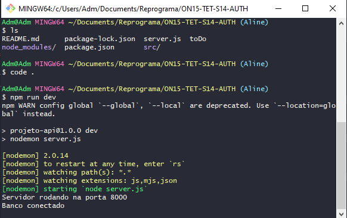
</p>

#### Pronto! Tudo funcionando.
```javascript

```
#### Para este projeto ja temos agumas coisinhas prontas. O arquivo `app.js`:
```javascript
    const express = require('express');
    const app = express();
    const cors = require('cors');

    require('dotenv-safe').config();

    const db = require('./config/database');
    const userRoutes = require('./routes/userRoutes');

    db.connect() ;

    app.use(cors());
    app.use(express.json());
    app.use("/users", userRoutes);

    module.exports = app;
```
#### O arquivo de configuração do banco de dados, o `database.js`:
```javascript
    const mongoose = require('mongoose')

    const connect = async () => {
        try {
            await mongoose.connect(process.env.MONGODB_URI, {
                useNewUrlParser: true,
                useUnifiedTopology: true
            })
            console.log("Banco conectado")
        } catch (error) {
            console.error("Erro: ", error.message)
        }
    }

    module.exports = {
        connect
    }
```
####  e como esse projeto refere-se a usuários, temos um schema de usuário no arquivo `userSchema.js`:
```javascript
    const mongoose = require('mongoose');

    const userSchema = new mongoose.Schema({
        id: mongoose.Schema.Types.ObjectId,
        name: {
            type: String,
            required: true
        },
        email: {
            type: String,
            required: true
        },
        password: {
            type: String,
            required: false
        },
        createdAt: {
            type: Date,
            default: new Date()
        }
    });

    module.exports = mongoose.model('user', userSchema);
```
#### Temos o arquivo `userController.js` para retornar todos os usuários:
```javascript
    const UserSchema = require("../models/userSchema");

    const getAll = async (req, res) => {
      UserSchema.find(function (err, users) {
        if(err) {
          res.status(500).send({ message: err.message })
        }
          res.status(200).send(users)
      }) 
    };

    module.exports = {
      getAll
    };
```
#### E temos uma rota também no arquivo `userRoutes.js`:
```javascript
    const express = require("express");
    const router = express.Router();

    const controller = require("../controllers/userController");

    router.get("/all", controller.getAll);

    module.exports = router;
```
#### Então ja podemos testar no Postman essa rota:
<p align="center">
  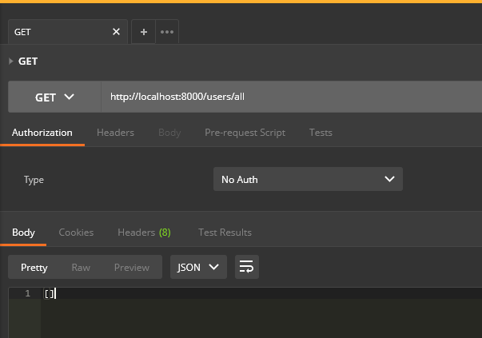
</p>

#### E retornou um array vazio porque ainda não temos nada no banco, mas, estão sabemos que a rota está funcionando. Temos outro arquivo na controller, chamado de `authController.js` onde vamos fazer o esquema de login ainda mas ja temos algumas configurações básicas nele:
```javascript
    const UserSchema = require('../models/userSchema');

    const login = (req, res) => {
        
    };

    module.exports = {
        login
    };
```
#### Então essa é a estrutura básica do nosso projeto da aula de hoje.
```
    ├─ ON15-TET-S14-AUTH
    ├─ node_modules           
    ├─ src                       
    │   ├─ config 
    |   |    └─ database.js       
    │   │  
    |   ├─ controllers   
    │   |    ├─ authController.js 
    |   |    └─ userController.js      
    │   │   
    |   ├─ models   
    │   |    └─ userSchema.js                
    │   │      
    |   ├─ routes
    │   |    └─ userRoutes.js                    
    │   │     
    |   |  
    │   └─ app.js       
    |          
    ├─ .env
    ├─ .env.example             
    ├─ .gitignore  
    ├─ package-lock.json
    ├─ package.json 
    ├─ README.md 
    ├─ server.js             
    └─ ToDO
```
#### Agora vamos criar o processo de autenticação conhecendo o fluxo de autenticação:
1. - Criação de Usuário
2. - Login do Usuário
3. - Autenticação do Usuário
4. - Autorização de Visualização

___
## 1. `Criação de Usuário` - Uma usuária é criada e sua senha é armazenada como um hash (usando o bcrypt). Então vamos criar uma rota de criação de usuários, o `POST`:
```javascript
    const createUser = async (req, res) => {
      try{
        const newUser = new UserSchema(req.body);

        const savedUser = await newUser.save();
        
        res.status(201).send({
          "message": "Usuário criado com Sucesso!",
          savedUser
        })
      } catch(e) {
        console.error(e);
      };
}
```
#### Exportar ela:
```javascript
    module.exports = {
    getAll,
    createUser
};
``` 
#### E configurar a rota:
```javascript
    router.post("/create", controller.createUser);
```
#### Agora vamos testar no `Postman`, colocando as informações de um usuário, que no caso coloquei meus dados:
<p align="center">
  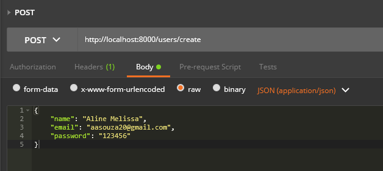
</p>

#### Clicndo no `SEND` e...: 
<p align="center">
  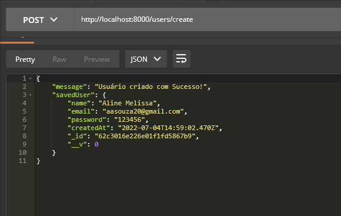
</p>

#### O usuário foi criado! Rota ok e como retornou o esperado, o banco de dados também está armazenando corretamente.
#### Quando criamos o usuário... a senha está a mostra, então o que iremos fazer é `hashear` essa senha pra que não seja mostrada. Então vamos `criptografar`, e para isso teremos que instalar n=um novo pacote, o `bcrypt`, então vamos primeiro matar o servidor osando o <kbd>Ctrl C</kbd>:
```git
    npm i bcrypt
```
#### Ao terminar a instalação, rode o projeto novamente:
```git
    npm run dev
```
#### Agora vamos atualizar a maneira que estamos salvando a senha do usuário no nosso banco. Vamos na controller e importar o `bcrypt`:
```javascript
    const bcrypt = require("bcrypt")
```
#### Agora precisamos `hashear` a senha incluindo uma variável que vai receber uma função do `bcrypt`:
```javascript
    const hashDePassword = bcrypt.hashSync(req.body.password, 10)
```
#### Agora vamos reatribuir valores:
```javascript
    req.body.password = hashDePassword
```
#### Ou seja, estamos pegando o que vem do body da requisição e transformando na senha hasheada, e ai nosso código da criação de usuário ficará assim:
```javascript
    const createUser = async (req, res) => {
      const hashDePassword = bcrypt.hashSync(req.body.password, 10)
      req.body.password = hashDePassword
      try{
        const newUser = new UserSchema(req.body);

        const savedUser = await newUser.save();
        
        res.status(201).send({
          "message": "Usuário criado com Sucesso!",
          savedUser
        })
      } catch(e) {
        console.error(e);
      };
}
```
#### Vamos testar criando um novo usuário:
<p align="center">
  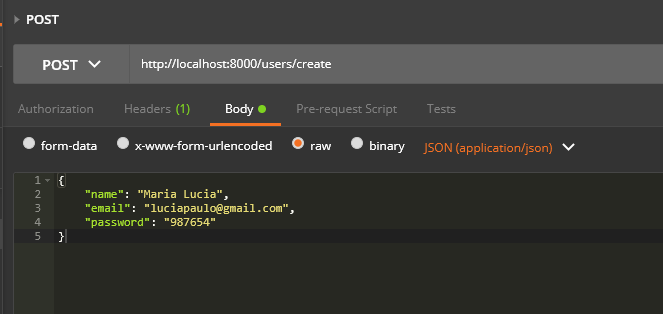
</p>

#### E apertando o <kbd>SEND</kbd>:
<p align="center">
  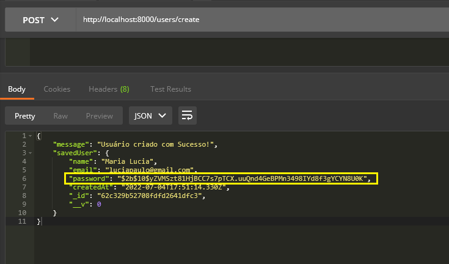
</p>

#### A senha ja foi salva `hasheada`. Vamos agora ir para a parte do login, criando uma rota para o login.

___

## 2. `Login do Usuário` - Na request de login, no body da request são enviados os dados necessários para autenticação (email e senha, por exemplo). Então bora lá.
```javascript
    router.post('/login', controller.login);
```
#### Configuramos a rota com a função login, mas essa função está em outro arquivo, o `authController.js`, então vamos requerir esse arquivo primeiro:
```javascript
    const authController = require("../controllers/authController");
```
#### Agora vamos alterar a rota:
```javascript
    router.post('/login', authController.login);
```
#### E para saber se o usuário está cooreto, temos primeiro que saber se esse usuário existe no nosso banco de dados, então teremos a função abaixo:
```javascript
    const login = (req, res) => {
    try { // filtro é o email do usuário seguido de uma função anônima que terá um erro um usuário
         UserSchema.findOne({ email: req.body.email }, (error, user) => {
            console.log("USUÁRIO:", user)
            if(!user) {
                return res.status(401).send({
                    message: "User não encontrado",
                    email: `${req.body.email}`
                })
            }
            const validPassword = bcrypt.compareSync(req.body.password, user.password);
            console.log(validPassword)
        })
    } catch(e) {
        console.error(e)
    }
};

```
#### Agora vamos comparar as senhas usando uma função do `bcrypt`:
```javascript
    bcrypt.compareSync(req.body.senha, user.senha);
```
#### Salvando isso numa variável:
```javascript
    const validPassword = bcrypt.compareSync(req.body.password, user.password);
    console.log(validPassword)
```
#### E ja que estamos usando o bcrypt, precisamos requerir ele no arquivo, então:
```javascript
    const bcrypt = require("bcrypt");
```
#### Vamos testar a rota no Postman.
**Obs: usamos o verbo POST porque pegamos as informações do body e não porque criamos usuários**
#### Peguei um usuário do meu banco que ja está com a senha hasheada, porém temos que passar a senha original do usuário:
<p align="center">
  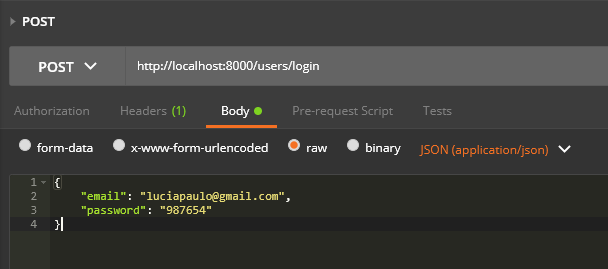
</p>

#### E vamos enviar:
<p align="center">
  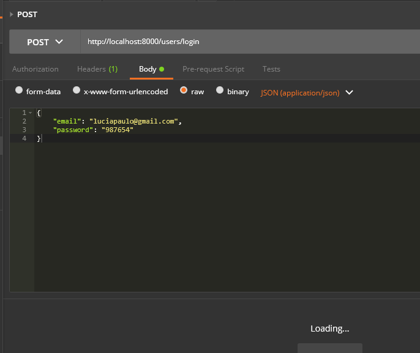
</p>

#### Só que o Postman não vai retornar nada, mas vamos olhar no terminal:
<p align="center">
  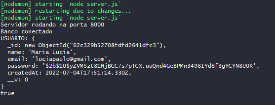
</p>

#### Retornou os dados do usuário do nosso banco, vamos agora tentar enviar um usuário que não existe:
<p align="center">
  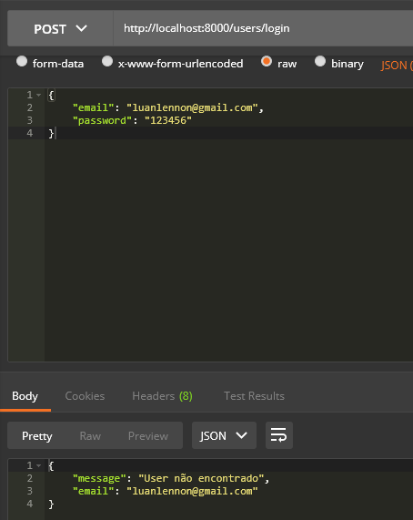
</p>

#### Retornou a mensagem de que o usuário não existe. Agora vamos fazer uma verificação:
```javascript
      if(!validPassword) {
        return res.status(401).send({
        message: "Login não autorizado"
    })
  }
```
#### Se a senha não for verdadeira, o login não será autorizado.
<p align="center">
  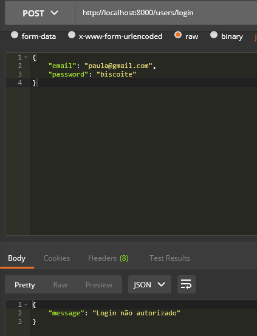
</p>

#### Agora que já está tudo verificado, precisamos gerar um selo que garanta que a senha está correta.
___

## 3. `Autenticação do Usuário` - Instalar "`jsonwebtoken`" via npm install e fazer require do pacote JWT. Então vamos instalar:
```git
    npm i jsonwebtoken
```
#### Depois de instalado, vamos rodar novamente o projeto:
```javascript
    npm run dev
```
#### Agora vamos requerer ele no nosso arquivo `authController.js`:
```javascript
    const jwt = require("jsonwebtoken")
```
#### Vamos então chamar ele no projeto e utilizar um método dele chamando mais dois parâmetros: o nome do usuário e o `segredo` que é gerado através de um site chamado [Online RSA Key Generator](https://travistidwell.com/jsencrypt/demo/):
<p align="center">
  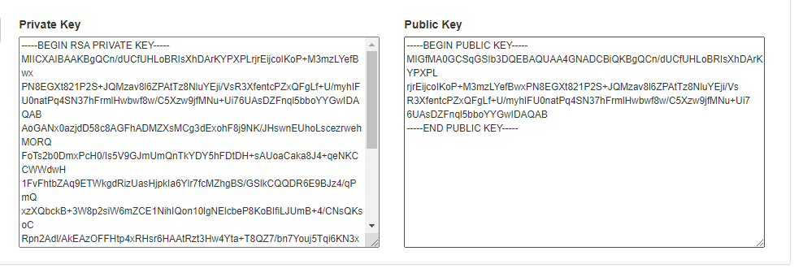
</p>

#### Ele gera chaves Pública e Privada. Vamos usar somente o que aparece na chave Pública, somente o código:
<p align="center">
  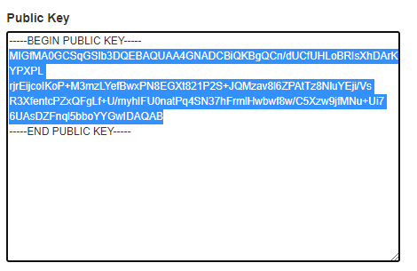
</p>

#### Esse é o `segredo` que vamos usar pro token funcionar salvando no arquivo `.env`:
<p align="center">
  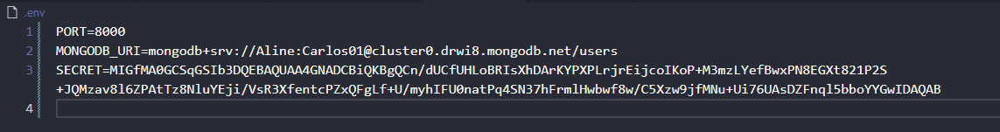
</p>

#### Lembre-se de tirar os espaços.  e como declaramos no arquivo `.env`, temos que declarar o arquivo `.ev.example` também:
<p align="center">
  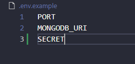
</p>

#### Agora vamos criar uma variável pra importar esse segredo do arquivo `.env`:
```javascript
    const SECRET = process.env.SECRET;
```
#### Agora vamos usar ele:
```javascript
    const token = jwt.sign({ name: user.name}, SECRET)
```
#### Agora vamos verificar olhando como está o nosso código agora:
```javascript
    const UserSchema = require('../models/userSchema');
    const bcrypt = require("bcrypt");
    const jwt = require("jsonwebtoken");

    const SECRET = process.env.SECRET;

    const login = (req, res) => {
    try {
        UserSchema.findOne({ email: req.body.email }, (error, user) => {
            console.log("USUÁRIO:", user)
            if(!user) {
                return res.status(401).send({
                    "message": "User não encontrado",
                    email: `${req.body.email}`
                })
            }
            const validPassword = bcrypt.compareSync(req.body.password, user.password);
            console.log("A SENHA É VÁLIDA?", validPassword)

            if(!validPassword) {
                return res.status(401).send({
                    "message": "Login não autorizado"
                })
              }
              const token = jwt.sign({ name: user.name}, SECRET)
              console.log("Token criado", token);

              res.status(200).send({
                "message": "Login autorizado!",
                token
              });
        })
    } catch(e) {
        console.error(e)
    }
};

module.exports = {
    login
};
```
#### Agora vamos testar colocando um usuário com a senha errada:
<p align="center">
  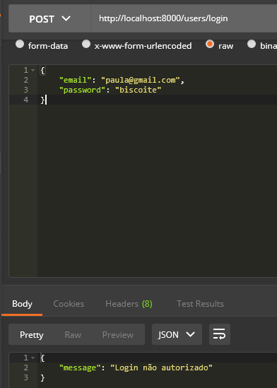
</p>

#### Agora vamos tentar entrar com usuário e senha corretos:
<p align="center">
  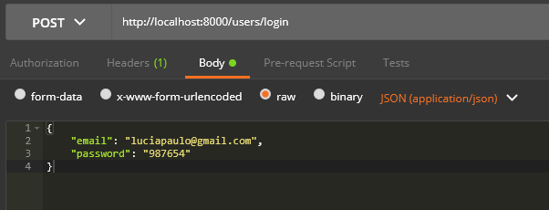
</p>

#### E o retorne foi:
<p align="center">
  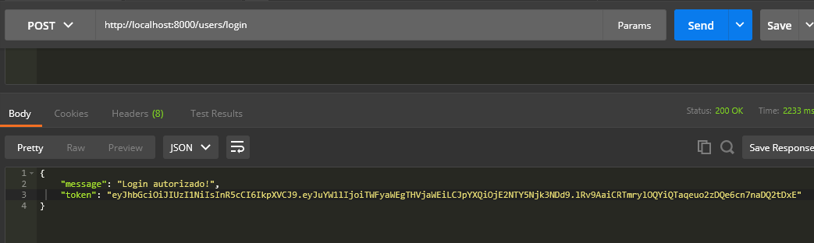
</p>

#### O Login foi autorizado e gerou o token. Finalizamos o processo.
___

## 4. `Autorização de Visualização` - Com o login realizado, a cada nova requisição o token é enviado no body da requisição permitindo a autorização de visualização.

#### Pra isso vamos transformar a nossa rota do GetAll. Então vamos começar requerindo o JWT para o arquivo `userController.js`.
```javascript
    const jwt = require("jsonwebtoken");
```
#### E vamos requerir também o `SECRET`:
```javascript
    const SECRET = process.env.SECRET;
```
#### Dentro da função `getAll` 
```javascript
    const getAll = async (req, res) => {
    const authHeader = req.get('authorization') // definimos aqui que vem uma autorização
    const token = authHeader.split(' ')[1];

  if (!token) {
    return res.status(401).send("Erro no header")
  }
    
  UserSchema.find(function (err, users) {
    if(err) {
      res.status(500).send({ message: err.message })
    }
      res.status(200).send(users)
  }) 
}
```
#### Vamos lá, pra conseguirmos acessar a rota `http://localhost:8000/users/all` terá uma autorização nela, então precisamos passar um parâmetro antes de simplesmente vir aqui e enviar a requisição, então faremos assim, no campo abaixo colocaremos a palavra `Authorization`:
<p align="center">
  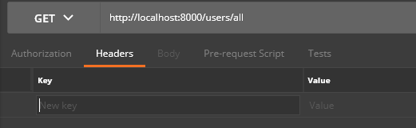
</p>

#### Assim:
<p align="center">
  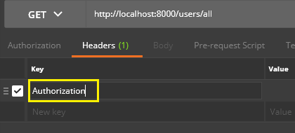
</p>

#### E no campo `value` colocaremos uma palavra reservada (`Baerer`) seguida de espaço e o token gerado. É uma medida de segurança.
<p align="center">
  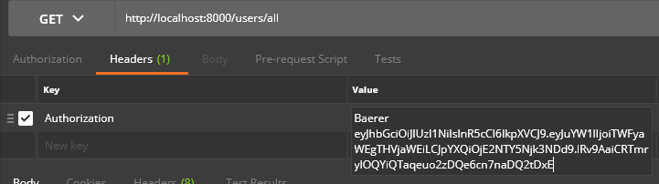
</p>

#### Só que queremos apenas o token, então usamos um método de javascript para remover o espaço que é nessa linha de código:
```javascript
    const token = authHeader.split(' ')[1];
```
#### Se eniarmos essas informações no GET, o retorno no terminal será:
<p align="center">
  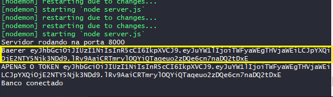
</p>

#### O de cima é antes de utilizarmos o método, e o debaixo como podemos ver, nos retorna somente o token.
```javascript
      jwt.verify(token, SECRET, function(erro) {
        if (err) {
          return res.status(403).send('Não autorizado');
      }
    });
```
#### E acima fará a verificação se poderá ver ou não o schema:
<p align="center">
  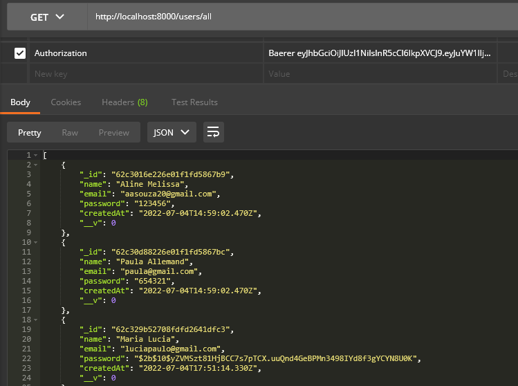
</p>

#### Coloquei as informações corretas e... após a verificação o acesso foi concedido!
