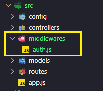
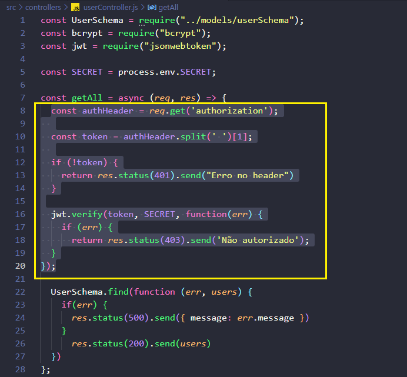

## `Conteúdo Extra`
#### Agora... vamos imaginar que temos várias rotas para autenticar. Então teríamos que incluir o trecho de código de autenticação em cada uma das rotas e, isso não faria sentido, ficar repetindo o mesmo código. Então, na rota, antes do usuário entrar na rota deveria acontecer a autenticação, então ficaria assim teoricamente:
```javascript
router.get("/all", `verificação de autorização`, controller.getAll);
```
#### Já entendemos a necessidade de ter uma verificação dentro da rota. Vamos criar uma psta chamada `middlewares` e dentro dela vamos criar um arquivo chamado `auth.js` que vai gerenciar a autorização. 
<p align="center">
  
</p>

#### Então vamos no arquivo `userController.js`, o código está assim:
```javascript
const getAll = async (req, res) => {
  const authHeader = req.get('authorization');
  
  const token = authHeader.split(' ')[1];
  
  if (!token) {
    return res.status(401).send("Erro no header")
  }

  jwt.verify(token, SECRET, function(err) {
    if (err) {
      return res.status(403).send('Não autorizado');
  }
});

  UserSchema.find(function (err, users) {
    if(err) {
      res.status(500).send({ message: err.message })
    }
      res.status(200).send(users)
  }) 
};
```
#### E retirar a parte do código de autenticação de lá 
<p align="center">
  
</p>

#### E incluir no arquivo `auth.js` levando junto as requisições do `SECRET` e `jwt`, então o arquivo ficará assim:
```javascript
const jwt = require("jsonwebtoken");

const SECRET = process.env.SECRET;

const checkAuth = () => {
    const authHeader = req.get('authorization');  
    const token = authHeader.split(' ')[1];

    if (!token) {
      return res.status(401).send("Erro no header")
    }

    jwt.verify(token, SECRET, function(err) {
      if (err) {
        return res.status(403).send('Não autorizado');
        }
    }); 
}
```
#### E como só teremos essa função neste arquivo, pdemos exportar direto na função assim: 
```javascript
exports.checkAuth = (req, res) => {
    const authHeader = req.get('authorization');  
    const token = authHeader.split(' ')[1];

    if (!token) {
      return res.status(401).send("Erro no header")
    }
    try{
        jwt.verify(token, SECRET, function(erro) {
          if (erro) {
            return res.status(403).send('Não autorizado');
            }
        }); 
    } catch(erro) {
        console.error(erro)
    }
}
```
#### Pronto! E o arquivo `userController.js` ficará assim: 
```javascript
const UserSchema = require("../models/userSchema");
const bcrypt = require("bcrypt");


const getAll = async (req, res) => {
  UserSchema.find(function (err, users) {
    if(err) {
      res.status(500).send({ message: err.message })
    }
      res.status(200).send(users)
  }) 
};

const createUser = async (req, res) => {
  const hashDePassword = bcrypt.hashSync(req.body.password, 10)
  req.body.password = hashDePassword
  try{
    const newUser = new UserSchema(req.body);

    const savedUser = await newUser.save();
    
    res.status(201).send({
      "message": "Usuário criado com Sucesso!",
      savedUser
    })
  } catch(err) {
    console.error(err);
  };
}

module.exports = {
  getAll,
  createUser
};

```
#### A partir de agora podemos usar a autorização em qualquer lugar do projeto. Agora vamos usar essa função mas pra daqui o código continuar seguindo a lógica ja criada de antes, temos que usar o `next` depois da req e da res:
```javascript
exports.checkAuth = (req, res, next)
```
#### Então, após isso nosso código de autorização ficará assim:
```javascript
exports.checkAuth = (req, res, next) => {
    const authHeader = req.get('authorization');  
    const token = authHeader.split(' ')[1];

    if (!token) {
      return res.status(401).send("Erro no header")
    }
    try{
        jwt.verify(token, SECRET, function(erro) {
          if (erro) {
            return res.status(403).send('Não autorizado');
            }
        }); 
        next();
        
    } catch(erro) {
        console.error(erro)
    }
}
```
**Obs: Se não colocar o `next`, não funciona, ele é extremmente importante!**
#### Agora vamos no arquivo userRoutes.js requerir essa função pra usarmos:
```javascript
  const { checkAuth } = require("../middlewares/auth");
```
####  E agora vamos usar ele na rota finalmente:
```javascript
router.get("/all", checkAuth, controller.getAll);
```
#### 