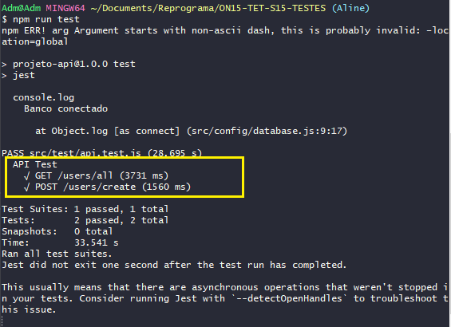

## `Passo a Passo Teste da Rota POST`
___


#### Como basicamente a estrutura é a mesma, vamos repetir alguns passos vistos anteriormente somente alterando o que for necessário:
```javascript
    test("POST /users/create", (done) => {
            request(app)
                .post("/users/create")
                .expect("Content-Type", /json/)
                .send({
                    name: "Paula",
                    email: "paula@gmail.com",
                    password: "senhamuitodificil"
                })
                .expect(201)
                .end((err, res) => {
                    if(err) return done(err);
                    return done();
                })
        })
```
#### Agora vamos testar:
```git
    npm run test
```
<p align="center">
  
</p>

#### Teste concluido, veja que agora ele testou as duas rotas que criamos o teste e as duas passaram no teste. 
