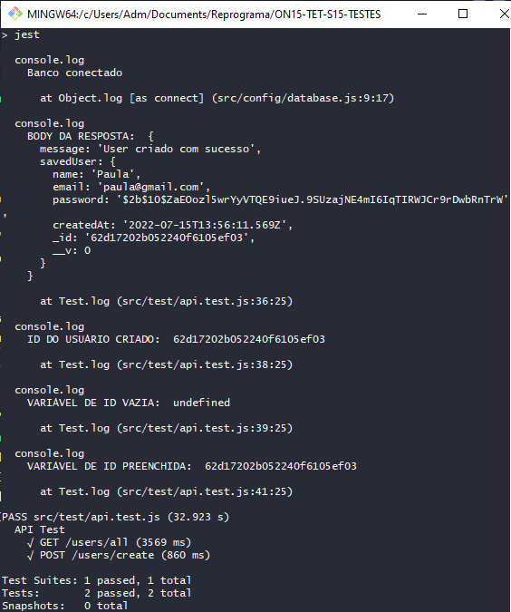
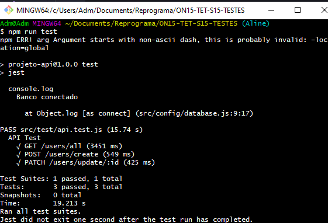
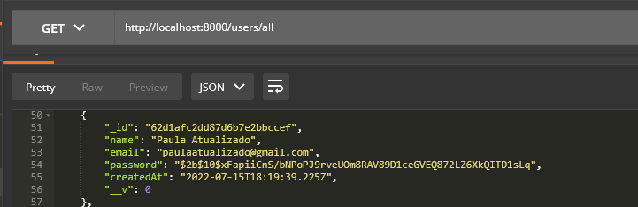

## `Passo a Passo Teste da Rota PATCH`
___


#### Pra criar o teste precisamos do ID e, ele está no banco e, este teste não esta pegando as infrmações do banco, então, teremos que criar uma variável que pegará esse ID para que possamos usar ele, vamos ver como. Essa variável será vazia porque ela será igual ao ID do usuário que acabou de ser criado.
```javascript
    let elementId;
```
#### E vamos dar um console no código do POST para ver:
```javascript
    test("POST /users/create", (done) => {
        request(app)
            .post("/users/create")
            .expect("Content-Type", /json/)
            .send({
                name: "Paula",
                email: "paula@gmail.com",
                password: "senhamuitodificil"
            })
            .expect(201)
            .end((err, res) => {
                console.log("BODY DA RESPOSTA: ", res.body)
                if(err) return done(err);
                console.log("ID DO USUÁRIO CRIADO: ", res.body.savedUser._id)
                console.log("VARIÁVEL DE ID VAZIA: ", elementId)
                elementId = res.body.savedUser._id;
                console.log("VARIÁVEL DE ID PREENCHIDA: ", elementId)
                return done();
            })
    });
```
#### E porque que stamos fazendo isso no `POST`? Por que eu preciso do `ID` de algum registro pra conseguir atualizar esse documento e de onde que vamos pegar o ID? Do `POST` porque essa rota cria um usuário. Agora vamos rodar para ver:
```git
    npm run test
```
#### E...
<p align="center">
  
</p>

#### Agora vamos realmente testar a rota do PATCH.
```javascript
    test("PATCH /users/update/:id", (done) => {
        request(app)
        .patch(`/users/update/${elementId}`)
        .expect("Content-Type", /json/)
        .send({
            name: "Paula Atualizado",
            email: "paulaatualizado@gmail.com"
        })
        .expect(200)
        .expect((res) => {
            expect(res.body.savedUser._id).toBe(elementId);
            expect(res.body.name).toBe("Paula Atualizado");
            expect(res.body.email).toBe("paulaatualizado@gmail.com");
        })
        .end((err, res) => {
            if(err) return done(err);
            return done();
        });
```
#### Agora vamos rodar:
```git
    npm run test
```
#### E...
<p align="center">
  
</p>

#### O teste testou as 3 rotas e... as 3 rotas passaram no teste. E ai... por desencargo de consciência, se olharmos no Postman, vamos ver que:
<p align="center">
  
</p>

#### O usuário foi criado!
