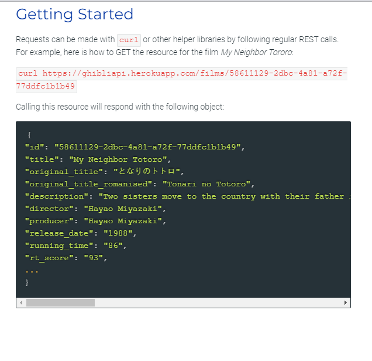
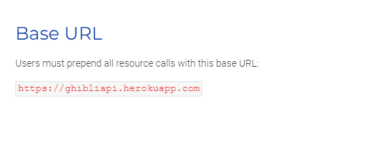
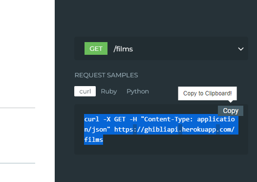
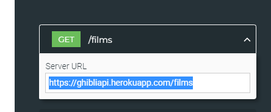

## ✔️ `Consumindo API`
___  
### No próprio site da API que voce quer utilizar existe uma documentação de como consumir.
#### Exemplo:
#### Site da [Studio Ghibli API](https://ghibliapi.herokuapp.com/). Este site disponibiliza numa API as informações dos filmes.
___
### `Primeira forma de fazer Requisição`
#### Exemplo de como fazer uma requisição:

  

#### URL base para fazer a requisição:

  

#### `Curl`:

  

**O que é `curl`? É uma forma de consumir uma `API`, na verdade conseguimos consimir qualquer `API` através do `curl`, consumimos direto do nosso terminal**
#### Copiando o `curl` e colando no seu terminal, ele trará um `JSON` enorme com todas as respostas de filmes da ghibli, podemos fazer `GET`, `POST`, `PUT`, `PATCH` e `DELETE`, tudo no seu terminal, porque no caso, nosso terminal vira o Client.
#### Esta é a rota:

  

___
### `Segunda forma de fazer Requisição`
#### Consumindo pelo `Front-End`, mas não vamos focar nisso pois o curso é de `Back-End`.
___
### `Terceira forma de fazer Requisição`
#### Essa é a que mais vamos utilizar é pelo `Postman`.
#### Podemos baixar ou usar o `Postman` do Chrome.
#### Pra que serve o `Postman`?
#### Pra criar um Client, pra testar enquanto desenvolve o Back-End.