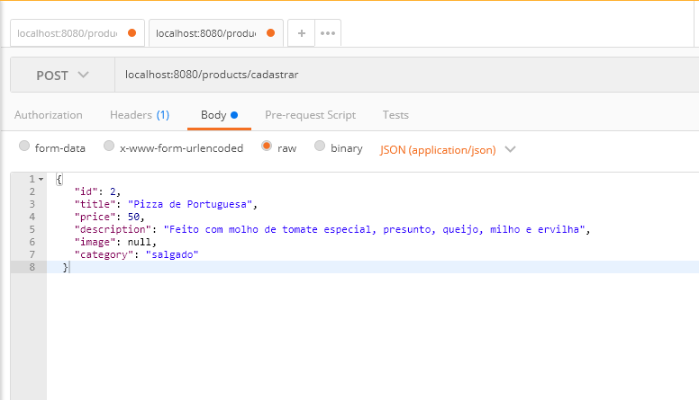
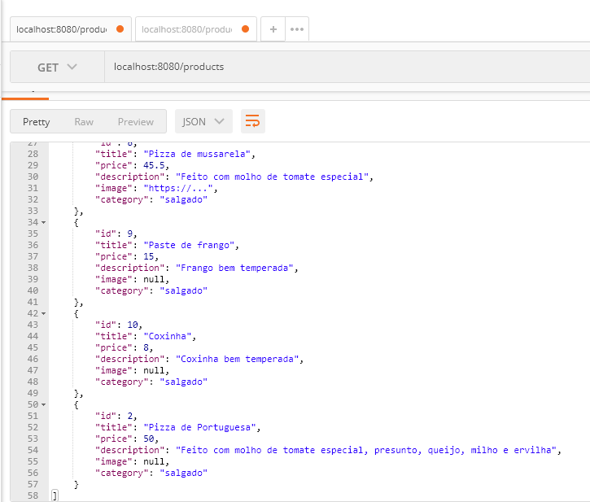
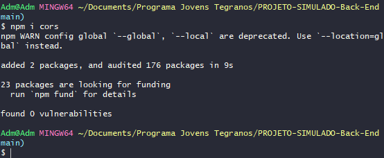
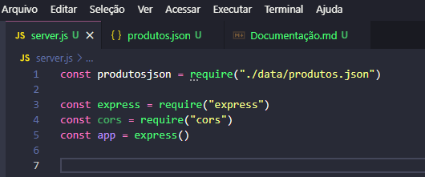

## ✔️ `Nosso Primeiro Servidor Passo-a-Passo 3`


___
## `Criando uma rota de cadastro, POST`
#### Vamos criar agora o método `POST`. Mão na massa!!
#### E já que o método é o Post, iniciamos com o `app.post`, configurar a rota `("products/cadastrar")` que terão uma request e uma response `(request, response)` seguido de uma arrow function... Até aqui nosso código esta assim:
```javascript
app.post("products/cadastrar", (request, response) => {

})
```
#### Vamos, aqui, usar o `body`, ele será usado no `Post`, no `Put` e no `Path`, vamos cadastrar dados e enviar para o arquivo `.json` no caso. Pra isso, a primeira coisa que temos que fazer é pegar a requisição. Criar uma variável chamada `bodyRequest` que será `igual` a `request.body.title`.
```javascript
let bodyRequest = request.body.title
```
#### E no Postman, vamos simular um novo produto para que seja cadastrado. Como no meu arquivo Json eu não tenho um produto com o id 2, criei este abaixo:
<p align="center">
  
</p>

#### Se eu tentar incluir e colocar no console pra ver o que acontece... :
```javascript
console.log(request.body.title)
```
### Ele retornará um erro gigantesco!! Então teremos que usar o `parser` porque ele vai pegar o valor quebrado e transforma num `json`. Então lá no começo do meu código, eu vou fazer um:
```javascript
app.use(express.json())
```
#### O que ela vai fazer exatamente? Ela ta fazendo o parseamento do body. Isso é extremamente necessário pra ele funcionar corretamente. Até aqui nosso código está assim:
```javascript
app.post("/products/cadastrar", (request, response) => {
    let bodyRequest = request.body    
    console.log(request.body)
})
```
#### Lembrando que pra fazer o método POST, tem que usar o body, porque se não tiver body, eu não tenho o que cadastrar. Agora que eu peguei a informação, preciso construir um objeto pra conseguir realmente cadastrar. Então vamos fazer o seguinte: criar uma variável que vai se chamar `novoProduto`. Essa variável  que vai receber o novo produto:
```javascript
let novoProduto = {
        id: bodyRequest.id,
        title: bodyRequest.title,
        price: bodyRequest.price,
        description: bodyRequest.description,
        image: bodyRequest.image,
        category: bodyRequest.category
    }
```
#### Perceba que estou colocando os mesmos campos que ja tenho nos produtos ja cadastrados, e pra isso uso o body ` id: bodyRequest.id` porque são neles que estão as informações que eu cadastrei. Agora que tenho um novo objeto... como faço pra incluir um item num array?? Existe um método chamado `.push`, então:
```javascript
produtosjson.push(novoProduto)
```
#### Pegamos nosso arquivo , adicionamos o método `push` para incluir um novo produto. Agora vamos fazer a `response`.
```javascript
response.status(201).send({
        "Mensagem": "Novo Produto cadastrado com sucesso!", 
        novoProduto
    })
```
#### Aqui o `status é 201` porque foi `criado` algo. E agora, se voce for no `Postman` e usar o método `GET`, perceberá que o id que eu criei aparece na lista dos outros que eu ja tinha.
<p align="center">
  
</p>

#### Pronto...! Nosso método `POST` está criado e funcionando perfeitamente! O código do método `POST` completo do exemplo é este:
```javascript
app.post("/products/cadastrar", (request, response) => {
    let bodyRequest = request.body

    let novoProduto = {
        id: bodyRequest.id,
        title: bodyRequest.title,
        price: bodyRequest.price,
        description: bodyRequest.description,
        image: bodyRequest.image,
        category: bodyRequest.category
    }
    produtosjson.push(novoProduto)

    response.status(201).send({
        "Mensagem": "Novo Produto cadastrado com sucesso!", 
        novoProduto
    })
})
```

___
## `Dependências - Instalando o CORS`
#### Existe um erro muito comum na construção de `API's`, há muito tempo atrás o `Front-End` e o `Back-End` vinham do mesmo servidor, é uma regra regra que existe nos `browsers` que eles tem que vir da mesma origem, ou seja, todos os recursos do site tem que vir do mesmo domínio.
#### Instalar o `CORS`:
```git
npm install cors
```
#### ou:
```git
npm i cors
```
#### Ao término da instalação aparece assim no terminal:
<p align="center">
  
</p>

#### Após isso, vá no seu arquivo `server.js`, onde tem as requisições e chame o CORS:
```javascript
const cors = require("cors")
```
<p align="center">
  
</p>

#### Agora vamos usar:
```javascript
app.use(cors())
```

#### Apenas isso e ja estamos utilizando o `CORS`.
**Lembrando que: se sua API for consumida pelo Front-End, é obrigatória a instalação do CORS; e em todo novo projeto(API), instalar ele.**
