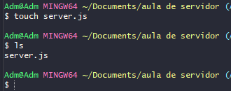
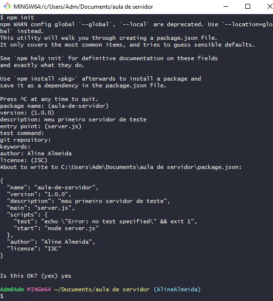
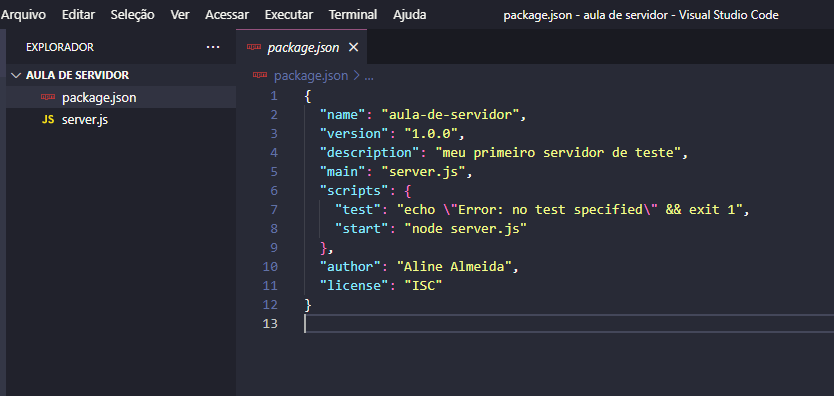
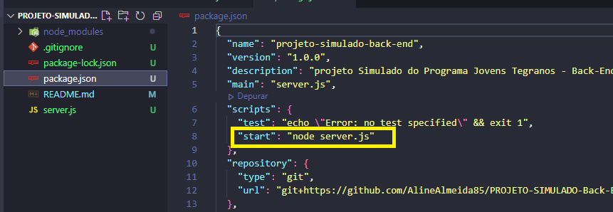
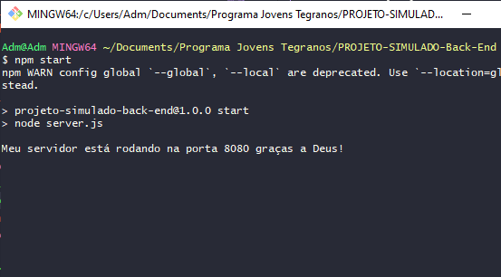

## ✔️ `Nosso Primeiro Servidor Passo-a-Passo 1`


___
## `Iniciando o servidor`
#### Existe um comando para iniciar um servidor dentro do Node.js. Mas primeiro abra o VSCode na pasta onde vai ser criado o servidor para acompanhar o progresso, digite:
```git
code .
```
#### Agora vamos criar nosso primeiro arquivo.
```git
touch server.js
```
#### Conforme a foto abaixo
<p align="center">
  
</p>

#### Perceba que digitei o comando acima e depois digitei 
```git
ls
```

___
## `Iniciando o npm`
#### para listar os itens que tem na pasta e apareceu o arquivo que acabei de criar com o nome `server.js`. Agora digite:
```git
npm init
```
#### Ele vai mostrar várias opções, seguem as descrições de cada uma:


___
```git
package name:
```
#### pode deixar com o nome sugerido mesmo. 
#### Tecle o <kdb>Enter</kdb>.


___
```git
version:
```
#### mantenha a versão.
#### Tecle o <kdb>Enter</kdb>.


___
```git
description:
```
#### Coloque por exemplo o nome do projeto acompanhado de uma breve descrição.
#### Tecle o <kdb>Enter</kdb>.


___
```git
entry point:
```
#### Onde começa a aplicação, que geralmente vai aparecer a sugestão.
#### Tecle o <kdb>Enter</kdb>.


___
```git
test command:
```
#### Podemos colocar depois.
#### Tecle o <kdb>Enter</kdb>.


___
```git
git repositor:
```
#### Podemos colocar depois. Mas se voce criou um repositório no gitHub e iniciou o projeto a partir do clone, este item ja estará preenchido, então não precisa mexer.
#### Tecle o <kdb>Enter</kdb>.


___
```git
keywords:
```
#### Podemos colocar depois.
#### Tecle o <kdb>Enter</kdb>.


___
```git
author:
```
#### Coloque o seu nome.
#### Tecle o <kdb>Enter</kdb>.


___
```git
licence: (ISC)
```
#### Deixe assim.
#### Tecle o <kdb>Enter</kdb>. E por fim irá aparecer uma pergunta:
```git
Is this OK? (yes)
```
#### Ele ja sugeriu a sua resposta
#### Escreva `yes`
#### Tecle o <kdb>Enter</kdb>.
#### E pronto, foi criado. A foto abaixo mostra os passos acima.
<p align="center">
  
</p>

#### Vá até o `VSCode` e verifique que foi criado um arquivo chamado `package.json` com as informações que preenchemos:
<p align="center">
  
</p>

#### Neste arquivo podemos editar as informações contidas nele.


___
## `Iniciando o npm de outra forma`
### Existe um outro comando para se fazer os passos acima, ele é mais fácil e rápido.
```git
npm init -y
```
#### Ele vai criar tudo de uma vez, podendo depois irmos até o arquivo `package.json` e editar as informações posteriormente.


___
### `Package.json`
#### O arquivo package.json é o ponto de partida de qualquer projeto `Node.js`. Ele é responsável por:
- `Descrever o seu projeto.`
- `Informar a versão do Node e do npm.`
- `URL do repositório.`
- `Versão do projeto.`
- `Dependências de produção e de desenvolvimento.` 


___
## `Dependências - Instalando o Express`
#### Sempre que instalarmos um pacote, ele vira uma `dependência`, ou seja, instalamos porque o projeto precisa dele para funcionar, então ele vira uma `dependência` (um item obrigatório).
#### Continuando no nosso terminal, digite:
```git
npm install express
```
#### ou
```git
npm i express
```
#### Vá no `VSCode` e perceba que foram criados mais dois arquivos: o `package-lock.json` e a pasta `node_modules`.


___
## `.gitignore`
#### Agora digite:
```git
touch .gitignore
```
#### Para criar o arquivo `.gitignore`. ele vai ignorar tudo o que for incluso lá. Veja como incluir a pasta `node_modules` no [`.gitignore` aqui.](https://github.com/AlineAlmeida85/Reprograma-Curso-Completo/blob/main/ON15-TET-S8-API-I/readme/README8.md)


___
## `Chamando o Express no arquivo`
#### Na sequência, vá no arquivo `server.js` para chamarmos o `Express`.
#### Digite:
```javascript
const express = require("express")
```
#### Aqui estamos requisitando o `Express` pro meu arquivo criando uma `constante` com o nome `express` que vai receber uma função chamada `require("express")` que chamará o `express`.


___
## `Executando o Express no arquivo`
#### Agora precisamos executar o `Express`, por dentro, ele é uma grande função. Para executar ele faremos:
```javascript
const app = express()
```
#### Ou seja, aqui estamos executando o `Express` criando outra `constante` com o nome `app` que irá receber a função `express()` guardando ele na variável `app`.


___
## `Criando a Porta`
#### Agora vamos criar a porta. Chamamos o `app`, `.listen` essa `função listen` é do `Express`, crio uma função `()` e vou configurar uma porta colocando o número que voce quiser, acima de 3000 `(8080)`, abrindo uma arrow function `() =>{ }` que vai executar a mensagem `console.log("Meu servidor está rodando na porta 8080 graças a Deus!")` pra mostrar que deu certo.
```javascript
app.listen(8080, () => {
  console.log("Meu servidor está rodando na porta 8080 graças a Deus!")
})
```
**Use sempre portas acima do número 3000, pois o que tem abaixo ja está sendo usado pelo seu computador**

#### Agora vamos `rodar` pra ver se deu tudo certo até aqui.


___
## `Testando o Servidor`
#### Agora no seu terminal digite:
```git
npm start
```
#### Que se voce for no arquivo `package.json`, perceberá que nos `scripts` há o comando `start` que está definido como `"node server.js"`, ou seja, digitar o comando acima é o mesmo que digitar o que está no arquivo como mostra na foto abaixo:
<p align="center">
  
</p>

#### E olha só o que aparecerá no terminal:
<p align="center">
  
</p>

#### Apareceu a mensagem do console, ou seja, seu servidor está funcionando!
**Lembrando que até aqui só `construimos um servidor`, ainda `não é uma API`, pois ainda faltam as rotas.**
#### Agora vamos criar nosso primeiro `GET.`


