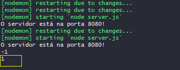

## ✔️ `Nosso Primeiro Servidor Passo-a-Passo 4` 
___


#### Construindo nossa rota `DELETE`. Iniciamos com o `app.delete`, chamando a rota `("/products/deletar/:id")`, porque o `:id`? Porque para deletar preciso do id, pois vou deletar um item só e não vários e antes de deletar algo, voce precisa encontrar esse algo a ser deletado, concorda? Teremos nosso callback que terá uma request e response como sempre `, (request, response) => { }`
```javascript
app.delete("/products/deletar/:id", (request, reponse) => {

})
```
#### Pronto! Montada nossa estrutura básica dp método `DELETE`. Agora vamos encontrar o item para deletar. Cria-se uma `variável` chamada `idRequest` que vai receber o `request.params.id`
```javascript
app.delete("/products/deletar/:id", (request, reponse) => {
    const idRequest = request.params.id
})
```
#### Então consegui pegar o que foi enviado no meu path params. Agora vamos encontrar o `let produtoEncontrado` percorrendo o meu item dentro do arquivo JSON `= produtosjson` com o método `.find` e na sequência quero que o produto que foi encontrado `(produto =>` cujo o id dele `produto.id` seja igual `==` ao id enviado na request `idRequest)`.
```javascript
app.delete("/products/deletar/:id", (request, reponse) => {
    const idRequest = request.params.id
    const produtoEncontrado = produtosjson.find(produto => produto.id == idRequest)
})
```
#### Por enquanto vamos imaginar que está tudo certo e não nos preocupar com possíveis erros. Agora vamos usar o método `splice`, que nada mais é que quando eu quero tirar(`excluir`) um item de um array e modificar o array uma vez que tirei um item dele usar o `indexof` para saber o índice do produto. Vamos lá! Criar uma variável `let indice` que receberá `=` o array `produtosjson` com o `.indexof` e com o `(produtoEncontrado)`, porque pra usar o splice eu tenho que saber o índice.
```javascript
    const indice = produtosjson.indexof(produtoEncontrado)
```
#### Agora vamos fazer um:
```javascript
console.log(indice)
```
#### Pra ver o que aparece, vamos no Postman escolher o método DELETE, colocar a rota `"/products/deletar/:id"`. no caso, eu pedi pra me mostrar o índice que eu selecionei, que no caso foi o 4.
<p align="center">
  
</p>

#### E se voce olhar no terminal...
<p align="center">
  
</p>

#### Aparece o indice 1 porque no meu arquivo `produtosjson` o indice que eu escolhi é o segundo da lista de array, e sendo o segundo ele, no array é o índice 1.
<p align="center">
  
</p>

#### Ou seja, até aqui tudo certo, meu código esta retornando o que eu selecionei no Postman. Agora vamos usar o splice. Pego o array `produtosjson` usando o `.splice`, com o indice que eu quero deletar `(indice)` que no caso é a variável `indice`, e vou dizer que é o 1 porque quero deletar somente ele e nada mais.
```javascript
produtosjson.splice(indice, 1)
```
#### E agora vamos fazer a response. Começamos com a response `response` seguida do número do `.status(200)` porque foi deletado, mandando o `.json()` colocando uma mensagem que foi deletado e mostrando o arquivo como ficou depois de deletar.
```javascript
response.status(200).json([{
    "Mensagem": "Produto Deletado com Sucesso!!!",
    "produto-deletado": produtoEncontrado,
    produtosjson
}])
```
#### E veja que apareceu a mensagem que configuramos...
<p align="center">
  
</p>

#### E nosso método DELETE está pronto!

#### Construindo nossa rota `PUT`. 
#### Chamamos o `app.put` seguido da minha rota `("/products/atualizar/:id)` porque antes de eu atualizar preciso localizar o que eu quero modificar, seguido do `(request, response)` e seguido de um callback `=> { }.
```javascript
app.put("products/atualizar/:id", (request, response) => {

})
```
#### Pronto...! A base ja está feita. Agora vamos criar uma variável `const idRequest` que vai receber o id que vai ser enviado no parâmetro `= request.params.id`.
```javascript
const idRequest = request.params.id
```
#### Agora vou pegar meu produto atualizado `const produtoAtualizado` que vai receber a informação do body `= request.body`.
```javascript
const produtoAtualizado = request.body
```
#### E agora vamos encontrar o produto criando uma variável `const produtoEncontrado` que receberá meu array `produtosjson` que procurará `.find` o produto cujo `(produto => )` o id do produto será igual ao id enviado no parâmetro `produto.id == idRequest`.
```javascript
const produtoEncontrado = produtosjson.find(produto => produto.id == idRequest)
```
#### Agora vamos usar o `indexOf` criando uma variavel indice `const indice` que vai receber o meu array `produtosjson` seguido do `.indexOf` passando o `produtoEncontrado`
```javascript
const indice = produtosjson.indexOf(produtoEncontrado)
```
#### Agora vamos fazer um
```javascript
console.log("body", produtoAtualizado)
```
#### e do produto que vai ser tualizado
```javascript
console.log("produto que vai ser atualizado", produtoEncontrado)
```
#### Nosso código está assim até agora:
```javascript
app.put("/products/atualizar/:id", (request, response) => {
    const idRequest = request.params.id
    const bodyRequest = request.body
    const produtoEncontrado = produtosJson.find(produto => produto.id == idRequest)
    const indice = produtosJson.indexOf(produtoEncontrado)
    
    bodyRequest.id = idRequest

    console.log(produtosJson.splice(indice, 1, bodyRequest))

})
```
#### Agora vamos usar o splice chamando o array `produtosjson.splice` colocando o indice que vamos retirar `(indice,)`, deletando ele `1`e colocando o `produtoAtualizado`.
```javascript
produtosjson.splice(indice, 1, produtoAtualizado)
```
#### Agora vamos criar a `response` com o `.status(200)` seguido do json com a mensagem:
```javascript
response.status(200).json([{
    "Mensagem": "Produto Atualizado com Sucesso!!",
    "produto-atualizado": produtosjson
}])
```
#### Agora vamos ver o produto que selecionei antes:
<p align="center">
  
</p>

#### Veja que escolhi este, e veja que:
<p align="center">
  
</p>

#### O campo `image` tirei a descrição da foto e acrescentei a palavra `null`. E o resultado foi exatamente o que esperávamos:
<p align="center">
  
</p>

#### Pronto! Nosso método PUT esta funcionando perfeitamente!" E o nosso código ficou assim:
```javascript
app.put("/products/atualizar/:id", (request, response) => {
    const idRequest = request.params.id
    const bodyRequest = request.body
    const produtoEncontrado = produtosJson.find(produto => produto.id == idRequest)
    const indice = produtosJson.indexOf(produtoEncontrado)
    
    bodyRequest.id = idRequest

    produtosJson.splice(indice, 1, bodyRequest)

    response.status(200).json([{
        "Mensagem": "Produto Atualizado com Sucesso!!",
        "produto-atualizado": produtosJson
    }])

})
```
#### Mas ainda falta uma coisa: independente do que for enviado no meu `bodyRequest`, eu vou fazer com que o `bodyRequest.id` seja igual ao `idRequest` como está no código final (linha 126)
#### Agora sim nosso método está concluído.

