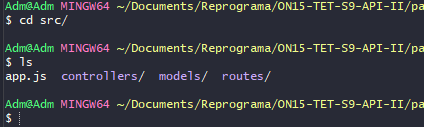
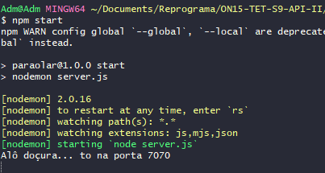
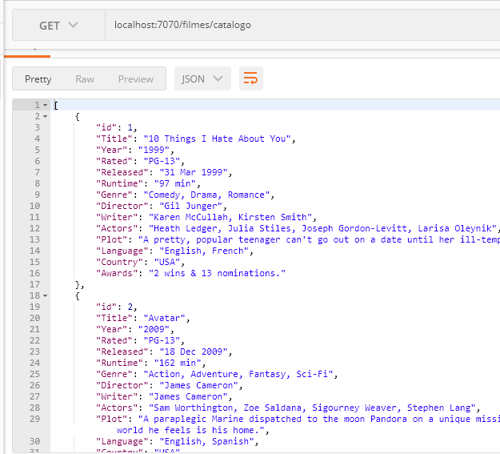

## ✔️ `Passo a Passo da Construção de um Servidor utilizando a Arquitetura MVC` 
___
#### A Arquitetura...
```
            📂 NOME-DO-SEU-PROJETO 
            |    
            ├─ package-lock.json         
            ├─ package.json  
            ├─ .gitignore 
            ├─ README.md             
            ├─ server.js
            ├─ 📂 src 
               |     
               ├─ app.js 
               |
               ├─ 📂 controller  
               |  |      
               │  └─ NOMEController.js  
               |      
               ├─ 📂 model 
               |  |            
               │  └─ NOMEModel.js  
               |    
               ├─ 📂 routes
               |  |             
               │  └─ NOMERouter.js  
               |                                   
            
```

#### Abra o `VSCode` na pasta raíz do seu projeto. Agora vamos criar um arquivo `server.js`. Digite no terminal o comando:
```git
touch server.js
```
#### Agora digite este comando para começar o projeto:
```git
npm init -y
```
#### Verificando o que tem na pasta até aqui... voce terá a `package.json` além do arquivo que acabamos de criar, o `server.js`. Instale a primeira dependência... o `express`
```git
npm i express
```
#### Agora na pasta raiz do seu projeto aparecerão os arquivos:  a `node_modules`, `package.json`, o `package-lock.json` e o `server.js`. Agora vamos criar uma pasta para armazenar a raíz de todo o meu código... a `src`:
```git
mkdir src
```
#### Esta pasta tem que existir... com esse nome mesmo! Agora entre na pasta `src` que acabamos de criar e crie 3 outras pastas: 
```git
mkdir controllers routes models
```
#### Este comando acima cria as 3 pastas de uma só vez, mas voce também pode criar manualmente. Agora vamos criar o arquivo `app.js`:
```git
touch app.js
```
#### Agora se voce listar, verá o que tem agora dentro dela:
<p align="center">
  
</p>

#### Qual a função da models??? Quando estivermos com o banco de dados, teremos uma configuração de banco de dados nela. Agora vamos trabalhar com o arquivo `dbConfig.js` que esta dentro da pasta `models` que, no caso não criamos, apenas copiamos ela de outro exemplo dado em aula, e, sendo assim, temos uma função pronta de exemplo para simular um banco de dados:
```javascript
function bancoDeDados(dado) {
    return new Promise((resolve, reject) => {
        setTimeout(() => {
            if(dado == "series"){
                return resolve(require("./series.json"))
            }
            else if(dado == "filmes"){
                return resolve(require("./filmes.json"))
            }
            else {
                return reject("Dado não encontrado!")
            }
            
        }, 2000);
    })
}
```
#### Porque estou fazendo uma `promise`?? Porque quando trabalho com banco de dados, ele será uma `promise`. Por enquanto, pre fazermos um `async/await` legal teremos que transformar essa minha chamada de banco de dados numa chamada `assíncrona`. Só que esse arquivo `dbConfig.js` não vai ter o código do arquivo `server.js` porque este código de configuração de portas ja sabemos que estara no `server.js`, então precisamos exportar essa função pra que possa ser usada em todo o meu código: 
```javascript
module.exports ={
  bancoDeDados
}
```
#### É exatamente com essa linha de código que conseguimos exportar essa função para ser usada em qualquer outro arquivo do meu projeto. Agora vamos para o pasta `controllers` criar a nossa lógica que usará os dados. Criei um arquivo chamado `filmesController.js`, a responsabilidade desse arquivo é ter todas as regras que construimos para serem chamadas pelas rotas:
```git
touch filmesController.js
```
#### Então vamos construir o primeiro método: o `GET` e para isso precisamos importar o banco de dados crindo uma variável que vai receber como requisição o local onde está o banco de dados `const dbConfig = require("../models/dbConfig")`: 
```javascript
const dbConfig = require("../models/dbConfig")
```
#### Agora vamos criar nossa primeira função assíncrona, uma `async function` como conexão com o banco de dados `dbConnect()` retornando um await do arquivo dbConfig com o banco de dados passando o filmes `{ return await dbConfig.bancoDeDados("filmes")}`
```javascript
async function dbConnect(){
  return await dbConfig.bancoDeDados("filmes")
}
```
**Lembrando que no arquivo dbConfig criei a possibilidade de conectar, na rota vamos realmente conectar**
#### Vamos criar a primeira função `GetAll` que vai retornar todos os filmes que será assíncrona `const getAll = async`e receberá também uma request e uma response `(request, response)` seguido de uma arrow function `=> { }`.
```javascript
const getAll = async(request, response) => {

}
```
#### Dentro da arrow function vamos ter uma variável que será uma conexão com o banco `const filmesJson = await dbConnect()`.
```javascript
const getAll = async(request, response) => {
  const filmesJson = await dbConnect()

}
```
#### Agora vamos construir a response:
```javascript
const getAll = async(request, response) => {
  const filmesJson = await dbConnect()

  response.status(200).send((filmesJson))
}
```
#### Vamos agora exportar essa função porque vamos usar ela em outro lugar também:
```javascript
module.exports ={
  getAll
}
```
#### Vamos então mexer com as rotas. Vá para a pasta `routes` e crie um arquivo dentro dela:
```git
touch filmesRoutes.js
```
#### Aqui teremos rotas e métodos de filmes. Faremos a primeira coisa que é chamar o controller criando uma variável chamada controller que vai receber como requisição o local onde está o filmesController
```javascript
const controller = require("../controllers/filmesController")
```
#### Agora vamos chamar o express:
```javascript
const express = require("express")
```
#### Crio agora uma variável chmada router que vai executar uma função do express que se chama Router
```javascript
const router = express.Router()
```
#### Agora vamos lá criar o método, a rota e a lógica:
```javascript
router.get("/catalogo", controller.getAll)
```
#### O que fizemos? Criamos uma rota catálogo que vai usar o método get e a função getAll. Agora precisamos exportar para usar ele no app.js:
```javascript
module.exports = router
```
#### Vamos resumir o que fizemos até aqui:
- ` 1 ` - Chamei o `controller` que está com a minha lógica
- ` 2 ` - Chamei o `express` que vai me ajudar a fazer funcionar
- ` 3 ` - Chamei uma `função de roteamento` do express
- ` 4 ` - Chamei o método, passei a segunda parte da minha rota e  o método que vai chamar a função
- ` 5 ` - Exportei ele dentro do `router`
#### Agora criaremos a parte da rota que sempre muda no arquivo `app.js` e a primeira coisa que vamos fazer é chamar o express:
```javascript
const express = require("express")
```
#### Agora vamos executar ele:
```javascript
const app = express()
```
#### Vamos fazer o import da continuação das rotas do filme:
```javascript
const filmesRoutes = require("./routes/filmesRoutes")
```
#### Agora vamos fazer o uso
```javascript
app.use("/filmes", filmesRoutes)
```
#### Agora... exportar...
```javascript
module.exports = app
```
#### A partir de agora, tudo o que eu usar o `app`, será exportado pra usar no arquivo `server.js`. Agora vamos finalmente mexer no servidor. E o que vai ficar dentro dele afinal?
```javascript
const app = require("./src/app")
```
#### A nossa variavel de porta:
```javascript
const PORT = 7070
```
#### E o app.listen que vai receber a porta e uma arrow function:
```javascript
app.listen(PORT, () => {
  
})
```
#### Pra que serve o `app.js`? CEntralizar o conteúdo da aplicação e configurar as rotas raízes. e finalmete... vamos rodar o servidor.
```git
npm start
```
#### E... 
<p align="center">
  
</p>

#### Agora vamos no Postman e...
<p align="center">
  
</p>

#### Está funcionando!


