# ON15-TET-S1-GIT 🤝

## Turma 15 - Todas Em Tech - Semana 01 - GIT 👩‍💻

### 👩‍🏫 [Professora: Amanda Silva](https://github.com/oskojess) ✍🏽
___

<details>
  <summary>
    <span>🔗 Links 🔗</span>
  </summary>
  <div>    
    * 📌<a href="https://www.youtube.com/watch?v=Z8w5KdLh170&list=PLymAQGA_lVagCUqYtEgogYohW4KJil1Qw&index=2">Link da aula - Parte 1</a><br/>
    * 📌<a href="https://www.youtube.com/watch?v=OQzHf-odpOg&list=PLymAQGA_lVagCUqYtEgogYohW4KJil1Qw&index=1">Link da aula - Parte 2</a><br/>
    * 📌<a href="https://www.youtube.com/watch?v=3AXFw8f4J0Q&list=PLymAQGA_lVagCUqYtEgogYohW4KJil1Qw&index=3">Link da aula - Reforço</a><br/>
    * 📌<a href="https://github.com/reprograma/ON15-TET-S1-GIT">Link do Repositório da Aula</a><br/>
    * 📌<a href="https://classroom.google.com/u/0/c/NDc5MjQyMDUxNjYz/a/NDcxOTMxMjk2NzM5/details">Guia de instalação - Node.js</a><br/>
    * 📌<a href="https://drive.google.com/file/d/1Fn0IAz2JVFTEUQrAvZdWuSFByxfA9Op7/view">Introdução ao GIT</a><br/>
  </div>
</details>

___
##  👀 O que foi visto na Aula? 🛠️
<details>
    <summary>
      <strong>➝ Introdução a Programação ✔️</strong>
    </summary>    
    <div align="center">        
      <table border=1>             
        <tr>
          <td align="center">👉</td>                
          <td>Conceitos de Hardware</td>                
          <td align="center">✅</td>
        </tr>
        <tr> 
          <td align="center">👉</td>
          <td>Conceitos de Software</td>                
          <td align="center">✅</td>
        </tr>
        <tr>    
          <td align="center">👉</td>            
          <td>Conceitos de Programação</td>                
          <td align="center">✅</td>
        </tr>
      </table>               
    </div>
</details>

<details>
    <summary>
      <strong>➝ Algoritmos ✔️</strong>
    </summary>
    <div align="center">         
      <table border=1>             
        <tr>
          <td align="center">👉</td>                
          <td>Exemplos e outras formas de Algoritmos</td>                
          <td align="center">✅</td>
        </tr>
        <tr> 
          <td align="center">👉</td>
          <td>Fluxograma </td>                
          <td align="center">✅</td>
        </tr>
        <tr>    
          <td align="center">👉</td>            
          <td>Pseudocódigo</td>                
          <td align="center">✅</td>
        </tr>
      </table>               
    </div>
</details>

<details>
    <summary>
      <strong>➝ Linguagens de Programação ✔️</strong>
    </summary>
    <div align="center">        
      <table border=1>             
        <tr>
          <td align="center">👉</td>                
          <td>Definição</td>                
          <td align="center">✅</td>
        </tr>
        <tr> 
          <td align="center">👉</td>
          <td>Front-End</td>                
          <td align="center">✅</td>
        </tr>
        <tr>    
          <td align="center">👉</td>            
          <td>Back-End</td>                
          <td align="center">✅</td>
        </tr>
        <tr>    
          <td align="center">👉</td>            
          <td>Banco de Dados</td>                
          <td align="center">✅</td>
        </tr>
        <tr>    
          <td align="center">👉</td>            
          <td>Cliente-Servidor</td>                
          <td align="center">✅</td>
        </tr>
      </table>               
    </div>
</details>

<details>
    <summary>
      <strong>➝ Linhas de Comando ✔️</strong>
    </summary>
    <div align="center">        
      <table border=1>             
        <tr>
          <td align="center">👉</td>                
          <td>Command Power / CMD: interpretador Windows, simples e funcional.</td>                
          <td align="center">✅</td>
        </tr>
        <tr>
          <td align="center">👉</td>                
          <td>PowerShell: criado pela Microsoft, é bem mais robusto com capacidade maior de programação</td>                
          <td align="center">✅</td>
        </tr>
        <tr>
          <td align="center">👉</td>                
          <td>Bash: Criado como software livre, é um Unix shell e linguagem de comando, assim como o anterior</td>                
          <td align="center">✅</td>
        </tr>
      </table>               
    </div>
</details>

<details>
    <summary>
      <strong>➝ Comandos básicos ✔️</strong>
    </summary>
    <div align="center">        
      <table border=1>             
        <tr>
          <td align="center">👉</td>                
          <td>pwd => encontrar o caminho para o diretório atual (da pasta) em que você está</td>                
          <td align="center">✅</td>
        </tr>
        <tr>
          <td align="center">👉</td>                
          <td>ls => listar todos arquivos da pasta que você está</td>                
          <td align="center">✅</td>
        </tr>
        <tr>
          <td align="center">👉</td>                
          <td>cd nome-da-pasta => entrar em uma pasta dentro da pasta que você está</td>                
          <td align="center">✅</td>
        </tr>
        <tr>
          <td align="center">👉</td>                
          <td>cd ~ => volta para a pasta raiz</td>                
          <td align="center">✅</td>
        </tr>
        <tr>
          <td align="center">👉</td>                
          <td>cd .. => volta uma pasta para trás</td>                
          <td align="center">✅</td>
        </tr>
        <tr>
          <td align="center">👉</td>                
          <td>mkdir nome-da-pasta => cria uma pasta</td>                
          <td align="center">✅</td>
        </tr>
        <tr>
          <td align="center">👉</td>                
          <td>rm nome-do-arquivo => deleta um arquivo</td>                
          <td align="center">✅</td>
        </tr>
        <tr>
          <td align="center">👉</td>                
          <td>rm nome-do-arquivo => deleta um arquivo</td>                
          <td align="center">✅</td>
        </tr>
        <tr>
          <td align="center">👉</td>                
          <td>rm nome-do-arquivo => deleta um arquivo</td>                
          <td align="center">✅</td>
        </tr>
        <tr>
          <td align="center">👉</td>                
          <td>whoami => identifica usuário que esta logado</td>                
          <td align="center">✅</td>
        </tr>
      </table>               
    </div>
</details>

<details>
    <summary>
      <strong>➝ Versionamento de código ✔️</strong>
    </summary>
    <div align="center">        
      <table border=1>             
        <tr>
          <td align="center">👉</td>                
          <td>Controle de versão</td>                
          <td align="center">✅</td>
        </tr>        
      </table>               
    </div>
</details>

<details>
    <summary>
      <strong>➝ Git ✔️</strong>
    </summary>
    <div align="center">        
      <table border=1>             
        <tr>
          <td align="center">👉</td>                
          <td>Ferramentas de versionamento e GitHub</td>                
          <td align="center">✅</td>
        </tr>        
      </table>               
    </div>
</details>

<details>
    <summary>
      <strong>➝ Git Conceitos Básicos ✔️</strong>
    </summary>
    <div align="center">        
      <table border=1>             
        <tr>
          <td align="center">👉</td>                
          <td>repositório -> pasta/local aonde o projeto é armazenado</td>                
          <td align="center">✅</td>
        </tr>
        <tr>
          <td align="center">👉</td>                
          <td>clone -> literalmente clonar(copiar uma versão) do repositório remoto o projeto para o nosso repositório local</td>                
          <td align="center">✅</td>
        </tr>
        <tr>
          <td align="center">👉</td>                
          <td>branches -> (galhos) uma parte muito útil no desenvolvimento coletivo, permite que cada usuário tenha seu “bracinho”(versão) dentro do projeto de maneira independente.</td>                
          <td align="center">✅</td>
        </tr>
        <tr>
          <td align="center">👉</td>                
          <td>pull -> puxar do repositório remoto para o repositório local as ultimas alterações.</td>                
          <td align="center">✅</td>
        </tr>
        <tr>
          <td align="center">👉</td>                
          <td>commit -> controla a versão de um arquivo, registrando através de uma mensagem que identifica as últimas alterações</td>                
          <td align="center">✅</td>
        </tr>
        <tr>
          <td align="center">👉</td>                
          <td>push -> puxar do repositório remoto para o repositório local as ultimas alterações</td>                
          <td align="center">✅</td>
        </tr>
        <tr>
          <td align="center">👉</td>                
          <td>merge -> quando unificamos branches diferentes</td>                
          <td align="center">✅</td>
        </tr>
        <tr>
          <td align="center">👉</td>                
          <td>fork -> é uma cópia de um projeto para a sua conta do GitHub, é como se fosse uma xerox mesmo.</td>                
          <td align="center">✅</td>
        </tr>
        <tr>
          <td align="center">👉</td>                
          <td>pull -> request: solicitação de merge da sua branch em um projeto de outra pessoa.</td>                
          <td align="center">✅</td>
        </tr>
        <tr>
          <td align="center">👉</td>                
          <td>rebase -> segue a linha de raciocínio do merge, mas apaga parte dos commits no histórico. Recomendado para ser usado entre branches de desenvolvovedores, não diretamente na branch principal por exemplo.</td>                
          <td align="center">✅</td>
        </tr>
      </table>               
    </div>
</details>

<details>
    <summary>
      <strong>➝ Comandos Iniciais ✔️</strong>
    </summary>
    <div align="center">        
      <table border=1>             
        <tr>
          <td align="center">👉</td>                
          <td>git init</td>                
          <td align="center">✅</td>
        </tr>
        <tr>
          <td align="center">👉</td>                
          <td>git add .</td>                
          <td align="center">✅</td>
        </tr>
        <tr>
          <td align="center">👉</td>                
          <td>git commit</td>                
          <td align="center">✅</td>
        </tr>
        <tr>
          <td align="center">👉</td>                
          <td>git push</td>                
          <td align="center">✅</td>
        </tr>
      </table>               
    </div>
</details>

<details>
    <summary>
      <strong>➝ Comandos iniciais detalhado ✔️</strong>
    </summary>
    <div align="center">        
      <table border=1>             
        <tr>
          <td align="center">👉</td>                
          <td>it init : inicializa o git no repositório local</td>                
          <td align="center">✅</td>
        </tr>
        <tr>
          <td align="center">👉</td>                
          <td>git add : adiciona um arquivo modificado ao stagging (área temporária)</td>                
          <td align="center">✅</td>
        </tr>
        <tr>
          <td align="center">👉</td>                
          <td>git status : mostra os status dos arquivos modificados</td>                
          <td align="center">✅</td>
        </tr>
        <tr>
          <td align="center">👉</td>                
          <td>git commit -m "mensagem" : cria um commit</td>                
          <td align="center">✅</td>
        </tr>
        <tr>
          <td align="center">👉</td>                
          <td>git pull : puxa as atualizações mais recente (remoto -> local)</td>                
          <td align="center">✅</td>
        </tr>
        <tr>
          <td align="center">👉</td>                
          <td>git push : envia as atualizações mais recentes (local -> remoto)</td>                
          <td align="center">✅</td>
        </tr>
        <tr>
          <td align="center">👉</td>                
          <td>git remote add origin caminho : adiciona o seu repositório local ao remoto</td>                
          <td align="center">✅</td>
        </tr>
        <tr>
          <td align="center">👉</td>                
          <td>git checkout -- nome-arquivo : descarta as alterações locais do arquivo informado</td>                
          <td align="center">✅</td>
        </tr>        
      </table>               
    </div>
</details>

<details>
    <summary>
      <strong>➝ Aprofundando no Git ✔️</strong>
    </summary>
    <div align="center">        
      <table border=1>             
        <tr>
          <td align="center">👉</td>                
          <td>git config --global user.name "mandypry"</td>                
          <td align="center">✅</td>
        </tr>
        <tr>
          <td align="center">👉</td>                
          <td>git config --global user.email “amanda.adgti@gmail.com”</td>                
          <td align="center">✅</td>
        </tr>
        <tr>
          <td align="center">👉</td>                
          <td>git config --list</td>                
          <td align="center">✅</td>
        </tr>
        <tr>
          <td align="center">👉</td>                
          <td>git config --global --unset user.name "Nome"</td>                
          <td align="center">✅</td>
        </tr>
        <tr>
          <td align="center">👉</td>                
          <td>git config --global --unset user.email “nome@email.com”</td>                
          <td align="center">✅</td>
        </tr>
      </table>               
    </div>
</details>

<details>
    <summary>
      <strong>➝ Git, conceitos básicos ✔️</strong>
    </summary>
    <div align="center">        
      <table border=1>             
        <tr>
          <td align="center">👉</td>                
          <td>git init</td>                
          <td align="center">✅</td>
        </tr>
        <tr>
          <td align="center">👉</td>                
          <td>git add ou git add nome-do-arquivo</td>                
          <td align="center">✅</td>
        </tr>
        <tr>
          <td align="center">👉</td>                
          <td>git commit -m "mensagem do commit"</td>                
          <td align="center">✅</td>
        </tr>
        <tr>
          <td align="center">👉</td>                
          <td>git status</td>                
          <td align="center">✅</td>
        </tr>
        <tr>
          <td align="center">👉</td>                
          <td>git remote add origin url-do-repo ou ssh-do-repo</td>                
          <td align="center">✅</td>
        </tr>
        <tr>
          <td align="center">👉</td>                
          <td>git remote -v</td>                
          <td align="center">✅</td>
        </tr>
        <tr>
          <td align="center">👉</td>                
          <td>git push origin nome-da-branch</td>                
          <td align="center">✅</td>
        </tr>
        <tr>
          <td align="center">👉</td>                
          <td>git clone url-do-repo</td>                
          <td align="center">✅</td>
        </tr>
      </table>               
    </div>
</details>

<details>
    <summary>
      <strong>➝ Git, sobre branches ✔️</strong>
    </summary>
    <div align="center">        
      <table border=1>             
        <tr>
          <td align="center">👉</td>                
          <td>git branch</td>                
          <td align="center">✅</td>
        </tr>
        <tr>
          <td align="center">👉</td>                
          <td>git checkout -b nome-da-branch</td>                
          <td align="center">✅</td>
        </tr>
        <tr>
          <td align="center">👉</td>                
          <td>git checkout nome-da-branch</td>                
          <td align="center">✅</td>
        </tr>
        <tr>
          <td align="center">👉</td>                
          <td>git branch -d nome-da-branch</td>                
          <td align="center">✅</td>
        </tr>
        <tr>
          <td align="center">👉</td>                
          <td>git push origin --delete nome-da-branch</td>                
          <td align="center">✅</td>
        </tr>
        <tr>
          <td align="center">👉</td>                
          <td>git merge nome-da-branch</td>                
          <td align="center">✅</td>
        </tr>
      </table>               
    </div>
</details>

<details>
    <summary>
      <strong>➝ Git, sobre forks ✔️</strong>
    </summary>
    <div align="center">        
      <table border=1>             
        <tr>
          <td align="center">👉</td>                
          <td>git clone url-do-seu-fork</td>                
          <td align="center">✅</td>
        </tr>
        <tr>
          <td align="center">👉</td>                
          <td>git remote add upstream url-do-repo-original</td>                
          <td align="center">✅</td>
        </tr>
        <tr>
          <td align="center">👉</td>                
          <td>git fetch (ou pull) upstream</td>                
          <td align="center">✅</td>
        </tr>
        <tr>
          <td align="center">👉</td>                
          <td>git rebase (ou merge) upstream/main</td>                
          <td align="center">✅</td>
        </tr>
      </table>               
    </div>
</details>


___
##  🔨 Casos de como e quando usar os comandos certos 🛠️

  * 👉 [**CRIAR** um repositório no **GitHub**](#✔️-criar-um-repositório-no-github)
  * 👉 [**CRIAR** um Projeto para publicar no **GitHub**](#✔️-criar-um-projeto-para-publicar-no-github)
  * 👉 [**Disponibilizar** um projeto numa página no **GitHub**]()
  * 👉 [**FORKAR** um projeto e alterá-lo]()
  * 👉 [**ATUALIZAR** um repositório **Forkado**]()


## ✔️ **CRIAR** um repositório no **GitHub**

#### Na sua página inicial do `GitHub`, no canto superior tem um menu num botão que tem o sinal de `+`, clique nele e clique em `New repository`:
<p align="center">
  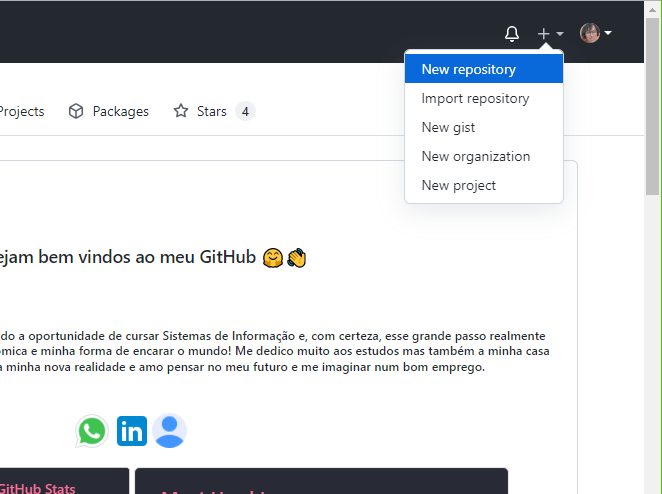
</p>

#### Voce será direcionado para outra página onde preencherá as informações para criar o seu repositório:
<p align="center">
  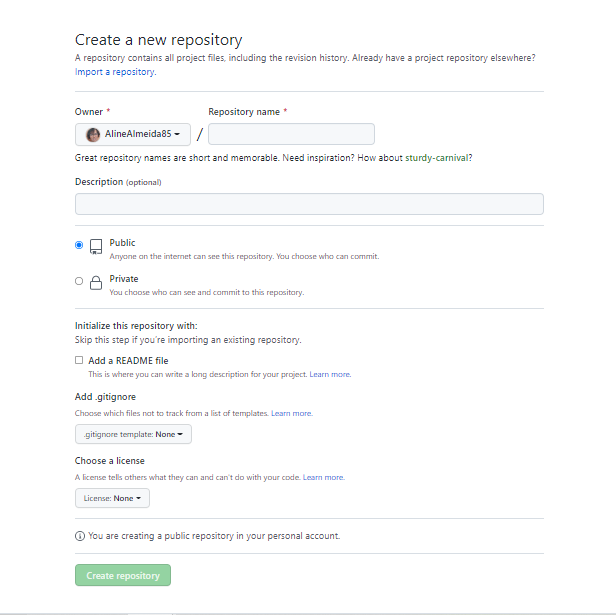
</p>

#### Aqui voce terá que preencher algumas informações importantes. No campo `Repository name` voce poderá criar o nome do seu repositório, **lembrando que não podem palavras com acentos**
#### Na sequencia voce poderá criar uma descrição para o seu repositório, isso é opcional mas, eu prefiro incluir
#### Abaixo oce terá a opção de escolher se quer o seu repositório  como `Public` ou `Private`. Qual a diferença? O **public** qualquer pessoa terá o direito de acessar o seu repositório e até melhorá-lo e o **private** somente voce terá como visualizar e alterar o repositório.
#### Na sequencia voce terá a opção de incluir o `README.md` ao seu repositório, isso também é opcional mas, como gosto de melhorar sempre os coneúdos dos meus eu sempre escolho incluir.
#### E pronto! o que realmente precisávamos fazer ja foi feito, agora clique em `Create repository` para concluir.
#### **Se voce não incluiu o `README.md`, voce será direcionado para essa página:**
<p align="center">
  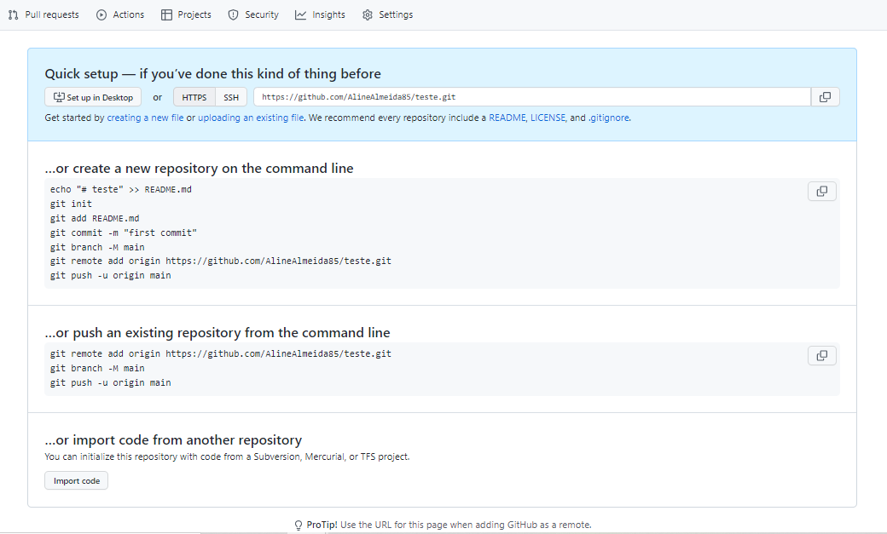
</p>

#### Onde aqui o que nos interessa realmente é o código gerado ( o endereço de página que se encontra na parte azul)
<p align="center">
  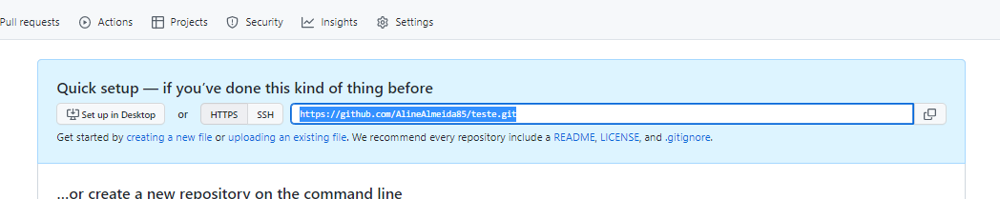
</p>

#### Copie esse cógido, é nele que está armazenado o repositório que voce acabou de criar.

#### ** Se voce optou pela criação do `README.md`, voce será direcionado para essa página:
<p align="center">
  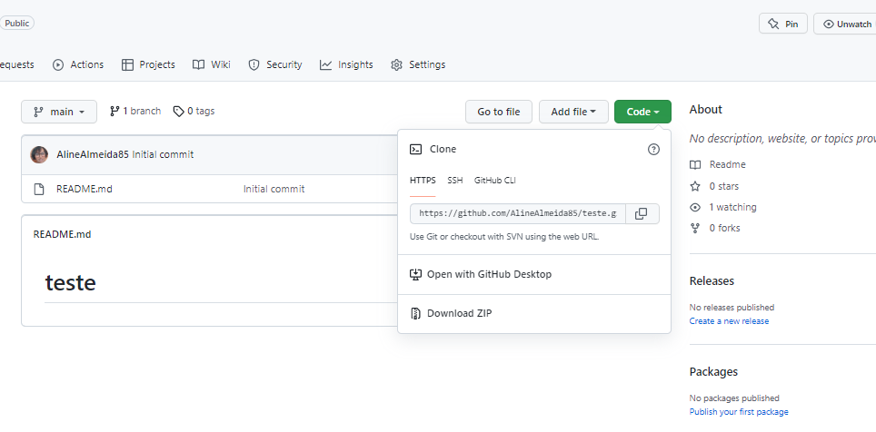
</p>

#### Clicando no botão `Code` como está na foto, copie esse cógido, é nele que está armazenado o repositório que voce acabou de criar.
#### Pronto!! o seu repositório do GitHub está criado

___
## ✔️ **CRIAR** um Projeto para publicar no GitHub

#### Após o que fou feito acima, vamos continuar
#### Copie o código que foi gerado
<p align="center">
  
</p>

#### Agora é o momento de começarmos a lidar com o `GitBash` ou `Git`.
#### Abra o seu terminal do `Git`, por natureza ele inicia na sua pasta raiz( no caso do seu computador), se preferir digite o comando:
```git
ls
```
#### para verificar em qual pasta exatamente ele está.
<p align="center">
  
</p>

#### Verifique que apareceram muitas pastas, porém pretendo salvar meu projeto na pasta `Documents`, então vou navegar até ela, então vou digitar:
```git
cd Documents
```
#### Digitei 
```git
ls
```
#### pois queria ver o que tem mais dentro da pasta (questão de curiosidade... rsrs), agora estou dentro da pasta que quero montar meu projeto
<p align="center">
  
</p>

#### A partir daqui iremos começar, no Git digite:
```git
git clone 
```
#### e cole o código que você copiou do GitHub
<p align="center">
  
</p>

#### o Git irá clonar em alguns segundos
<p align="center">
  
</p>

**Lembrando que no caso o nome do meu repositório é teste**
#### Depois de clonado, eu preciso entrar dentro desse clone que eu fiz para trabalhar no meu projeto, então digite:
```git
cd 
```
#### e na sequencia o nome do clone que no meu caso é `teste`
<p align="center">
  
</p>

#### Perceba que, agora trocou a palavra que estava entre parênteses,  `(main)`, agora podemos abrir esse repositório para trabalharmos nele.
```git
code .
```
#### para abrir o VScode ( será aberto em poucos instantes) ja com o seu projeto aberto e pronto!

#### depois de trabalhar no projeto, vamos devolvê-lo ao `GitHub`
#### no git digite:
```git
git add .
```
<p align="center">
  
</p>

#### com esse comando estamos incluindo tudo o que foi feito no projeto ao clone feito, agora digite:
```git
git commit -m
```
#### e entre aspas `" "` digite uma mensagem para informar o commit
<p align="center">
  
</p>

#### agora tudo pronto para a conclusão! Agora digite:
```git
git push
```
#### em poucos segundos... pronto! 
<p align="center">
  
</p>

#### Atualize a página do repositório e aparecerá la tudo que foi feito
<p align="center">
  
</p>

#### Pronto, o projeto ja está no `GitHub`

___
## ✔️ **Disponibilizar** um projeto numa página no Git**GitHub**Hub

#### Agora vamos aprender uma outra coisinha muito útil
#### Se voce crioi um portfólio por exemplo, voce tem como disponibilizá-lo no GitHub numa página para que fique fácil acessar o projeto, para mostrar como faremos, vou usar o projeto de teste que criei.
#### No GitHub, depois de subir o seu projeto, tem um menu em cima, clique em `Settings`:
<p align="center">
  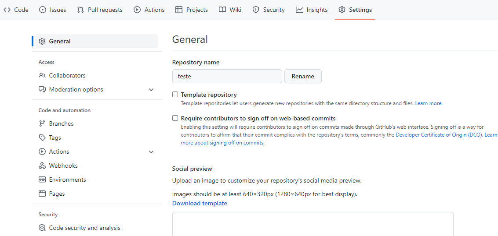
</p>

#### Voce será direcionado para esta página, e perceba que tem umas opções no menu á esquerda, clique em `Pages`:
#### Voce verá esta página:
<p align="center">
  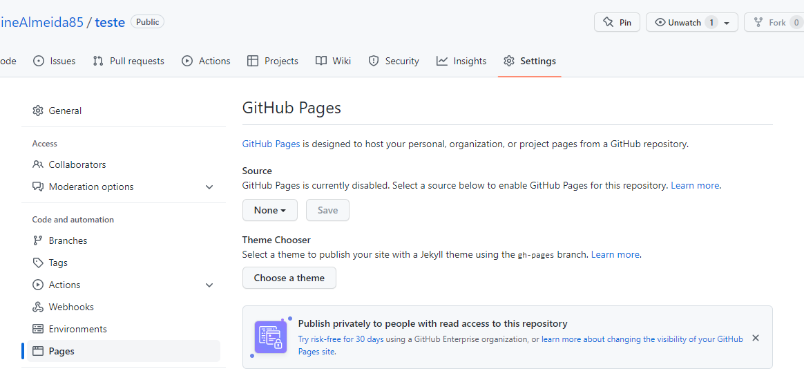
</p>

#### Aqui é simples, em `Source`, existe um botão com o nome de `None`, clique nele e perceba que existem duas opções: `main` e `None`, que é a que está selecionada, troque para a opção `main` e em seguida clique no botão `Save`
<p align="center">
  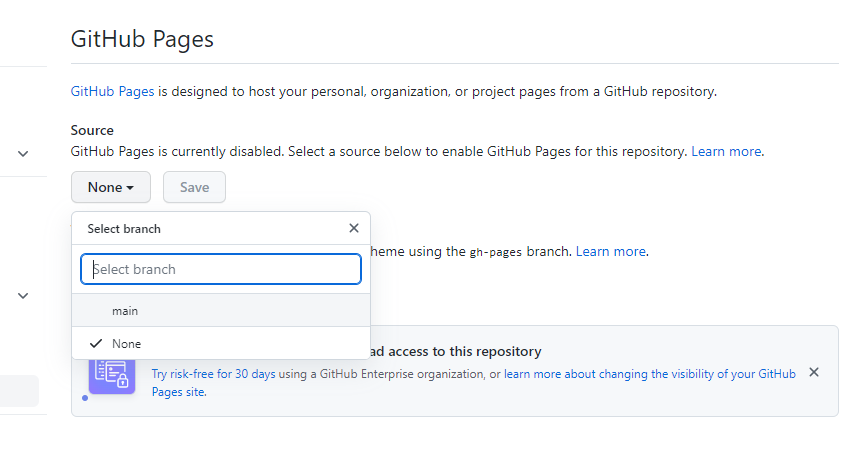
</p>

#### a página irá atualizar e, será disponilizado um link, copie ele e cole num navegador
<p align="center">
  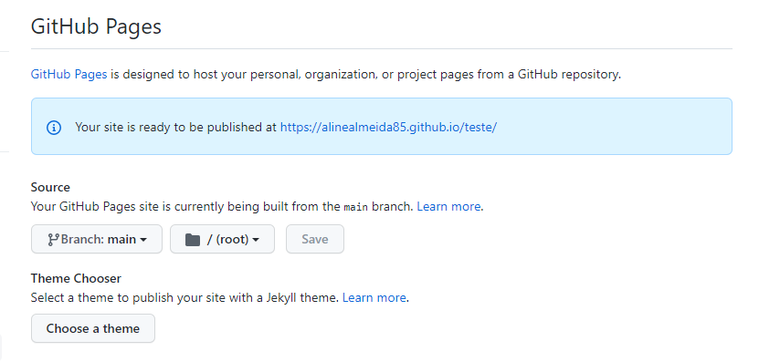
</p>

#### Prontinho!! Seu projeto está acessível numa página
<p align="center">
  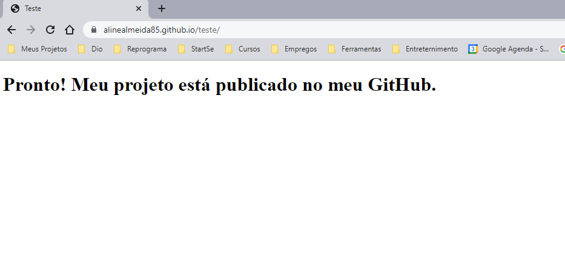
</p>

**Lembrando que para que isso seja possível, o arquivo `index` deve estar dentro da pasta do repositório e não em sub-pastas, pois quando selecionamos a opção `main`, o `GitHub` vai buscar pelo arquivo `index` para exibir o conteúdo e se esse arquivo não estiver no local correto não terá visibilidade, se tornando uma página sem conteúdo.**

___
## ✔️ **FORKAR** um projeto e alterá-lo

#### **Lembrando que o Fork é uma cópia de um projeto para a sua conta do GitHub, é como se fosse uma xerox mesmo.** 
#### No GitHub (ja imaginando que voce está na página do repositório que voce queira clonar), na parte superior da página, clique em **FORK**
<p align="center">
  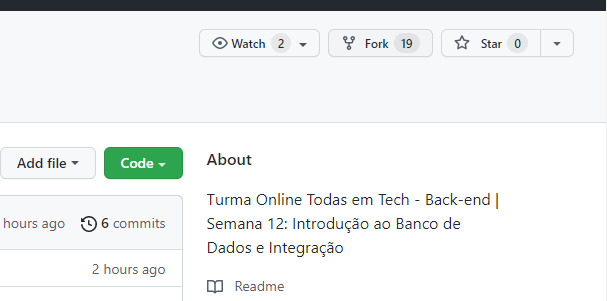
</p>

#### Voce será direcionado para uma página que irá te perguntar se deseja alterar o nome do repositório que quer clonar ou se prefere manter o nome, após isso copie o código.
<p align="center">
  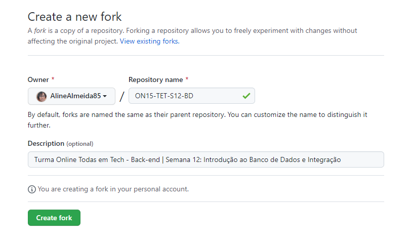
</p>

#### No meu caso não pretendo fazer alterações, então vou clicar no botão abaixo `Create fork`, depois disso seremos direcionados para a nossa página porém com o repositório forkado
<p align="center">
  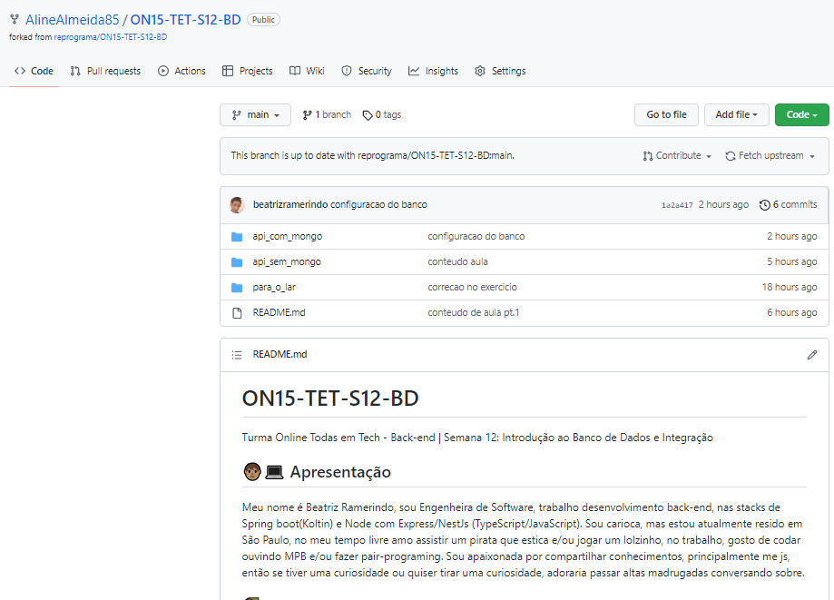
</p>

#### clique no botão `Code` como nos passos anteriores para pegar o cógido da página que voce acabou de forkar, no Git (supondo que voce ja esteja no local onde vai manter o repositório) e no meu caso tenho uma pasta da reprograma onde mantenho meus projetos, vou savlar meu repositório forkado lá.
#### No Git digite:
```git
git clone 
```
#### e cole o código que você copiou do GitHub, o Git irá clonar em alguns segundos.
<p align="center">
  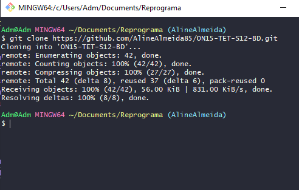
</p>

#### agora entre dentro da pasta do clone forkado, digite: 
```git
cd 
```
#### e o nome da pasta que no meu caso é `ON15-TET-S12-BD`
<p align="center">
  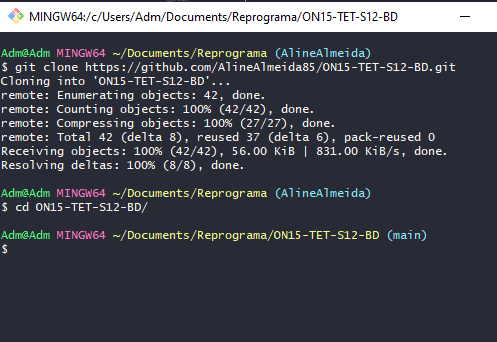
</p>

#### Perceba que, agora trocou a palavra que estava entre parênteses,  `(main)`, então precisamos criar uma branch para que realmente tenhamos um clone forkado nosso. Então criaremos uma branch. No Git digite:
```git
git checkout -b 
```
#### e na sequencia digite o nome que voce quer dar para a sua branch:
<p align="center">
  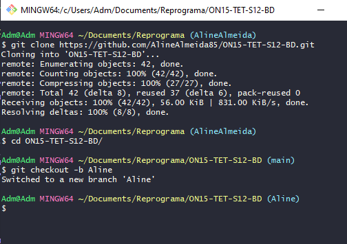
</p>

#### perceba que, criei uma branch com o nome `Aline`, e agora aparece esse nome entre os parênteses que antes estava com o nome `main`.
#### Agora, se quiser ja pode começar a codar o seu projeto digitando o comando:
```git
code .
```
#### Irá abrir o VScode ja com o seu projeto aberto e pronto! Ja pode fazer as alterações que quiser!


#### Depois de ter concluido o projeto, digite:
```git
git add .
```
#### para incluir as alterações feitas
#### agora digite:
```git
git commit -m "mensagem"
```
#### e entre aspas digite uma mensagem de sua preferência para justificar o commit
#### na sequencia digite:
```git
git push origin 
```
#### e digite o nome que voce deu para a sua branch
#### agora digite:
```git
git checkout main
```
#### agora digite:
```git
git merge 
```
#### e digite o nome que voce deu para a sua branch
#### e por ultimo digite:
```git
git push -u  
```
#### e digite o nome que voce deu para a sua branch e seguido de 
```git
git push -u  
```
#### e pronto!
___
## ✔️ Atualizar um repositório **Forkado**


