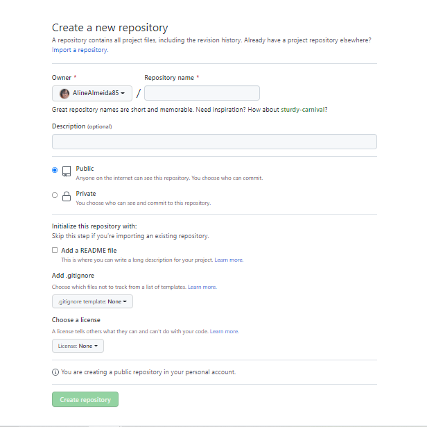

## ✔️ **CRIAR** um repositório no **GitHub**
___

#### Na sua página inicial do `GitHub`, no canto superior tem um menu num botão que tem o sinal de `+`, clique nele e clique em `New repository`:

  

#### Voce será direcionado para outra página onde preencherá as informações para criar o seu repositório:

  

#### Aqui voce terá que preencher algumas informações importantes. No campo `Repository name` voce poderá criar o nome do seu repositório, **lembrando que não podem palavras com acentos**
#### Na sequencia voce poderá criar uma descrição para o seu repositório, isso é opcional mas, eu prefiro incluir
#### Abaixo oce terá a opção de escolher se quer o seu repositório  como `Public` ou `Private`. Qual a diferença? O **public** qualquer pessoa terá o direito de acessar o seu repositório e até melhorá-lo e o **private** somente voce terá como visualizar e alterar o repositório.
#### Na sequencia voce terá a opção de incluir o `README.md` ao seu repositório, isso também é opcional mas, como gosto de melhorar sempre os coneúdos dos meus eu sempre escolho incluir.
#### E pronto! o que realmente precisávamos fazer ja foi feito, agora clique em `Create repository` para concluir.
#### **Se voce não incluiu o `README.md`, voce será direcionado para essa página:**

  

#### Onde aqui o que nos interessa realmente é o código gerado ( o endereço de página que se encontra na parte azul)

  

#### Copie esse cógido, é nele que está armazenado o repositório que voce acabou de criar.

#### ** Se voce optou pela criação do `README.md`, voce será direcionado para essa página:

  

#### Clicando no botão `Code` como está na foto, copie esse cógido, é nele que está armazenado o repositório que voce acabou de criar.
#### Pronto!! o seu repositório do GitHub está criado
