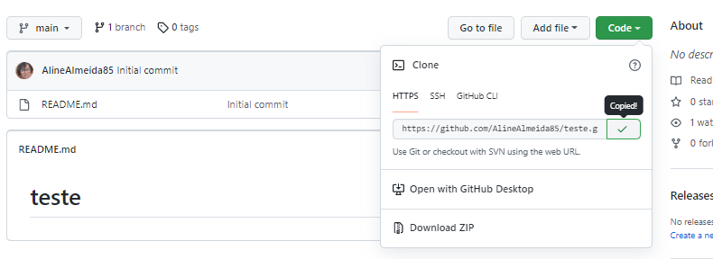
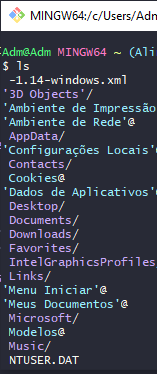
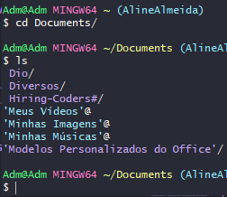
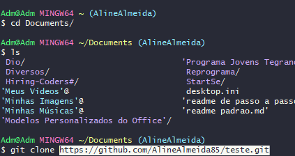
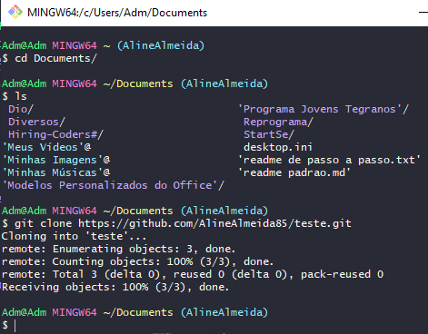
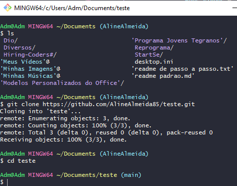
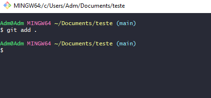
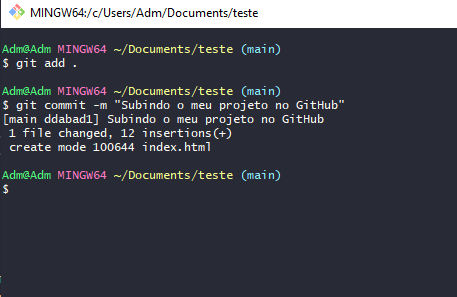
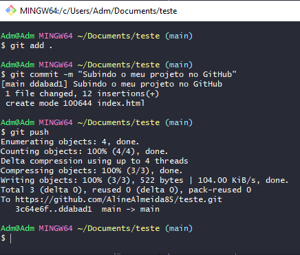
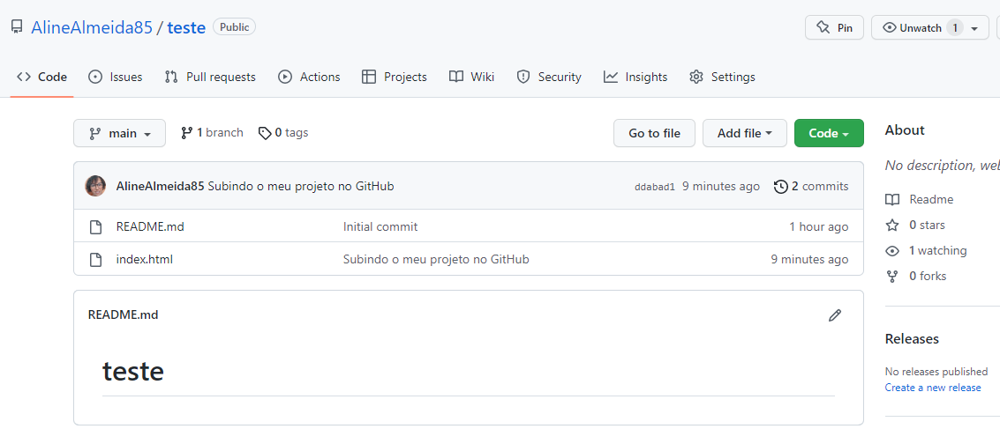

## ✔️ `Criar` um Projeto para publicar no `GitHub`
___

#### Após o que fou feito acima, vamos continuar
#### Copie o código que foi gerado
<p align="center">
  
</p>

#### Agora é o momento de começarmos a lidar com o `GitBash` ou `Git`.
#### Abra o seu terminal do `Git`, por natureza ele inicia na sua pasta raiz( no caso do seu computador), se preferir digite o comando:
```git
ls
```
#### para verificar em qual pasta exatamente ele está.
<p align="center">
  
</p>

#### Verifique que apareceram muitas pastas, porém pretendo salvar meu projeto na pasta `Documents`, então vou navegar até ela, então vou digitar:
```git
cd Documents
```
#### Digitei 
```git
ls
```
#### pois queria ver o que tem mais dentro da pasta (questão de curiosidade... rsrs), agora estou dentro da pasta que quero montar meu projeto
<p align="center">
  
</p>

#### A partir daqui iremos começar, no `Git` digite:
```git
git clone 
```
#### e cole o código que você copiou do `GitHub`
<p align="center">
  
</p>

#### o `Git` irá clonar em alguns segundos
<p align="center">
  
</p>

**Lembrando que no caso o nome do meu repositório é teste**
#### Depois de clonado, eu preciso entrar dentro desse clone que eu fiz para trabalhar no meu projeto, então digite:
```git
cd 
```
#### e na sequencia o nome do clone que no meu caso é `teste`
<p align="center">
  
</p>

#### Perceba que, agora trocou a palavra que estava entre parênteses,  `(main)`, agora podemos abrir esse repositório para trabalharmos nele.
```git
code .
```
#### para abrir o `VScode` ( será aberto em poucos instantes) ja com o seu projeto aberto e pronto!

#### depois de trabalhar no projeto, vamos devolvê-lo ao `GitHub`
#### no `Git` digite:
```git
git add .
```
<p align="center">
  
</p>

#### com esse comando estamos incluindo tudo o que foi feito no projeto ao clone feito, agora digite:
```git
git commit -m
```
#### e entre aspas `" "` digite uma mensagem para informar o commit
<p align="center">
  
</p>

#### agora tudo pronto para a conclusão! Agora digite:
```git
git push
```
#### em poucos segundos... pronto! 
<p align="center">
  
</p>

#### Atualize a página do repositório e aparecerá la tudo que foi feito
<p align="center">
  
</p>

#### Pronto, o projeto ja está no `GitHub`
