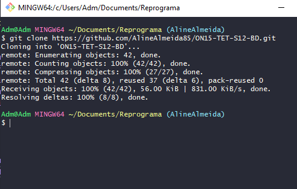
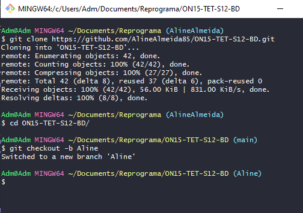

## ✔️ **FORKAR** um projeto e alterá-lo
___

#### **Lembrando que o Fork é uma cópia de um projeto para a sua conta do GitHub, é como se fosse uma xerox mesmo.** 
#### No GitHub (ja imaginando que voce está na página do repositório que voce queira clonar), na parte superior da página, clique em **FORK**
<p align="center">
  
</p>

#### Voce será direcionado para uma página que irá te perguntar se deseja alterar o nome do repositório que quer clonar ou se prefere manter o nome, após isso copie o código.
<p align="center">
  
</p>

#### No meu caso não pretendo fazer alterações, então vou clicar no botão abaixo `Create fork`, depois disso seremos direcionados para a nossa página porém com o repositório forkado
<p align="center">
  
</p>

#### clique no botão `Code` como nos passos anteriores para pegar o cógido da página que voce acabou de forkar, no Git (supondo que voce ja esteja no local onde vai manter o repositório) e no meu caso tenho uma pasta da reprograma onde mantenho meus projetos, vou savlar meu repositório forkado lá.
#### No Git digite:
```git
git clone 
```
#### e cole o código que você copiou do GitHub, o Git irá clonar em alguns segundos.
<p align="center">
  
</p>

#### agora entre dentro da pasta do clone forkado, digite: 
```git
cd 
```
#### e o nome da pasta que no meu caso é `ON15-TET-S12-BD`
<p align="center">
  
</p>

#### Perceba que, agora trocou a palavra que estava entre parênteses,  `(main)`, então precisamos criar uma branch para que realmente tenhamos um clone forkado nosso. Então criaremos uma branch. No Git digite:
```git
git checkout -b 
```
#### e na sequencia digite o nome que voce quer dar para a sua branch:
<p align="center">
  
</p>

#### perceba que, criei uma branch com o nome `Aline`, e agora aparece esse nome entre os parênteses que antes estava com o nome `main`.
#### Agora, se quiser ja pode começar a codar o seu projeto digitando o comando:
```git
code .
```
#### Irá abrir o VScode ja com o seu projeto aberto e pronto! Ja pode fazer as alterações que quiser!

