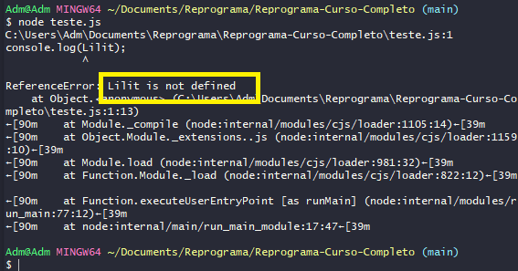
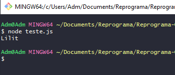
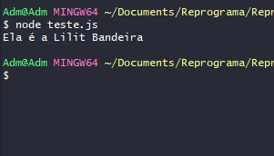

## `Dados`

___
### Os `dados `são basicamente são um instrumento importante, pois lidamos com dados o tempo todo. A `Entrada`, `Processamento` e `Saída` também se referem a `dados`.

___
## `String` 
### É uma sequência de caracteres que formam palavras, frases ou qualquer formação que será tratado como um texto, este tipo é comumente representado nas linguagens de programação com a utilização de `aspas` simples ou duplas, tendo o `JavaScript` ainda uma terceira forma com a utilização de crase:
```javascript
"Turma on15 backend"
'Todas em tech'
`Lógica de Programação` // Chamamos esta forma de template string ou string literal
```
#### Exemplo: 
#### Escrevi o código:
```javascript
console.log(Lilit);
```
#### e o resultado foi:
<p align="center">
  
</p>

#### perceba que no destaque da foto está escrito:
```git
Lilit is not defined
```
#### Quer dizer que eu não declarei a palavra `Lilit`, não disse o que ela significa, então quando isso acontece, sempre vai dar erro, pois no nosso código tuo tem que ser declarado, agora se eu digitar:
```javascript
console.log("Lilit");
```
#### o resultado é:
<p align="center">
  
</p>

#### Como assim?
#### Eu não declarei como variável, mas o fato de eu ter deixado o nome `Lilit` entre `aspas`, o `Git` entende que é uma `string`, tudo que está entre `aspas` ele entende como texto (`string`). Podemos usar aspas `simples`:
```javascript
console.log('Ela é a Lilit Bandeira');
```
#### , `duplas`: 
```javascript
console.log("Ela é a Lilit Bandeira");
```
#### ou a `crase`, porém tem diferença de qual usar e quando usar.

___
#### `Concatenação` -> É a operação de unir o conteúdo de duas ou mais strings;
```javascript
console.log('Lilit Bandeira tem' + 33 + 'anos')
console.log("Lilit Bandeira tem " + 19 + " anos")
console.log(`Lilit Bandeira tem ${33} anos`)
```
#### `""`: declarando somente textos.
#### `''`: também declarando somente textos.
#### ` `` `: Chamamos de `template string`, quando usamos `textos` e `variáveis` juntos, isso se chama `concatenação`, exemplo:
```javascript
var nome = "Lilit Bandeira";

console.log(`Ela é a ${nome}`);
```
#### resultado: 
<p align="center">
  
</p>

#### Ou seja, criei uma variável que recebe o valor de `"Lilit Bandeira"`, e quando eu chamo o `console` com a variável `nome`, ele me traz o valor da variável que é `"Lilit Bandeira"`.

___
#### `Number` -> É o tipo numérico primitivo do `JavaScript` , sendo divididos basicamente em números inteiros `int` ou ponto flutuante `float`, que são os números decimais;
```javascript
3
9.123
"4" // neste caso é uma string e não um number
```
___
#### `Boolean` -> Outro tipo primitivo também conhecido como tipo lógico, que tem apenas dois valores, que representam verdadeiro (`true`) ou falso (`false`), que podemos considerar como os binários 1 e 0.

___
#### `undefined` -> Valor dado para uma variável indefinida;
___
#### `null` -> Representa um objeto vazio, um valor nulo, ou seja, um objeto inexistente;
___
## Exemplos de `String`


