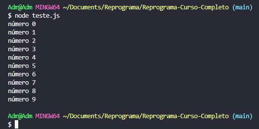

## ✔️ Podemos chamar também de Loop, laço ou método de iteração. Trata-se de comandos que mantém um trecho de código sendo executado até que uma condição de parada seja satisfeita;
## Sua principal função é possibilitar que possamos repetir um trecho de código sem a necessidade de escrever várias vezes esse trecho, para isso basta ter um ponto de partida e um ponto de chegada para a repetição;
___
### `for`
#### É uma estrutura de repetição com variável de controle, usada quando se sabe exatamente o ponto de partida e de chegada, o bloco será repetido `enquanto` a condição for `verdadeira`, ou seja, para quando a condição retorne `false`.
```javascript
  for (expressaoInicial; condicao; incremento) {
    código aqui;
  }
```
### Exemplos:
```javascript
for(let i = 0; i < 10; i++){ 
      console.log(`número ${i}`)
  }
```
#### Explicação Lógica: Enquanto `for(`, a variável `i` recebe o valor de `0`, `let i = 0;`, `i` é menor que `10`, ` i < 10;` e enquanto o `i` for menor que `10` irá incrementar `1` ao `i`, `; i++){` e no console irá mostrar o número i `console.log(`número ${i}`)`. O resultado será: 
<p align="center">
  
</p>

#### porque conforme a explicação o `i` vale `0` e enquanto ele for `menor` que `10` irá aparecer no console e somar mais `1`.

___
