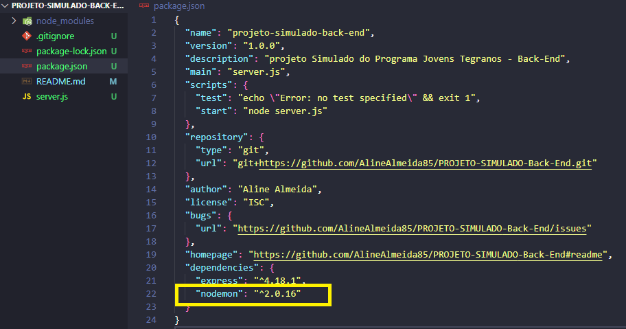
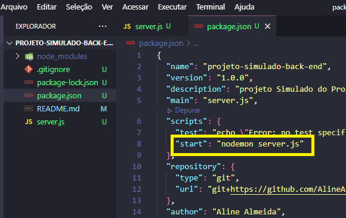
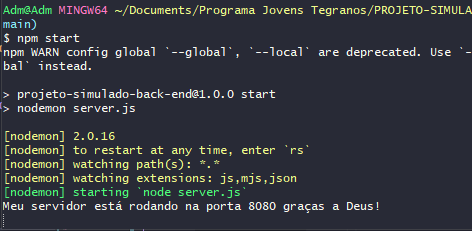

## ✔️ `Nodemon`
___

#### É uma dependência que nos ajuda a não precisar ficar matando o servidor e restartando novamente toda vez que tiver atualizações no projeto.
#### Como fazemos para usar ele?
#### Vamos instalá-lo como fazemos com dependências... ja que ele também é uma. Então vamos lá:
#### digite o comando:
```git
npm install nodemon
```
#### ou
```git
npm i nodemon
```
#### A instalação pode demorar um pouco, mas vamos aguardar.
<p align="center">
  
</p>

#### Pronto! Instalado! Se eu olhar no arquivo `package.json`, olha quem está lá!!!
<p align="center">
  
</p>

#### Agora vamos configurar: no mesmo arquivo (package.json) um pouco pra cima, no `start`, onde está escrito `node server.js` vamos alterar... ja que é aqui que configuramos a fomra de `startar` nosso projeto.
<p align="center">
  
</p>

#### Vamos tirar o `node server.js` e escrever `nodemon server.js`.
<p align="center">
  
</p>

**Lembrando que para cada projeto que voce for criar, é necesário instalar todas as dependências que for necessário para o projeto funcionar**

####  qual será a diferença depois que eu tiver instalado o Nodemon?
#### se eu digitar o comando que estávamos usando antes:
```git
npm start
```
#### Veja o que acontece:
<p align="center">
  
</p>

#### O servidor está rodando novamente, e a partir de agora, qualquer modificação no código, eu `não` preciso ficar `restartando`, ele fará isso sozinho. A única coisa que não podemos esquecer é que: vai desligar o computador... encerre o servidor com o mesmo comando de antes... `teclando Ctrl C`. E por que isso?? Porque senão, quando voce for usar a porta, ela estará em uso.