## ✔️ `Nosso Primeiro Servidor Passo-a-Passo 2`


___
## `Criando o GET`
#### Vamos configurar a primeira rota. Existe uma função pra construir o `GET`. Mas antes disso vamos nos certificar que estamos com os arquivos que devemos ter até aqui.
<p align="center">
  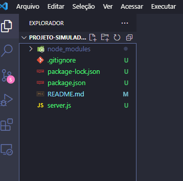
</p>

#### Como na foto acima devem ter estes arquivos no seu projeto.
#### Agora sim vamos partir para a primeira rota.
#### O `app.get` pois dentro do `Express` ja exite essa função `get` pronta e sempre que formos criar um `GET`, `POST`, `PUT`, `PATCH` ou `DELETE`, no primeiro parâmetro da função será a minha rota vazia só com a barra `("/")`, no segundo parâmetro será uma função `()` que vai receber o request e o response `(request, response)`, seguido de uma arrow function ` => ` e dentro dela será o que vai acontecer.
```javascript
app.get("/", (request, response) => {

})
```
#### Essa é a estrutura básica de uma requisição `get`. Então a `função get` espera que eu mande uma `rota`, e ela me retorna uma `outra função` (`callback`), e sempre vai me enviar uma `request` e uma `response`, porque são o que eu `preciso` pra fazer um `get`.
#### Aqui será onde vão acontecer as requisições(`request`), e se tem requisição eu vou enviar uma resposta, e nós como `Back-Ends` vamos configurar uma resposta(`response`) e pra fazer isso vamos fazer uma `response`, vou enviar um `.status`, colocando o número dele `(200)` pois é uma resposta positiva que queremos e vou mandar um `.json` falando `(["Salve, mundão"])`.
```javascript
app.get("/", (request, response) => {
  response.status(200).json(["Salve, mundão"])
})
```
#### Pronto! Criada a primeira rota. Agora vamos testar essa rota. Sempre que quiser `parar` o servidor, tecle `Ctrl C`.


___
## `Testando a rota`
#### Inicie o servidor novamente digitando:
```git
npm start
```
#### Agora vamos abrir o `Postman`, pois é nele que vamos `testar a rota` pra ver se está realmente funcionando. O que vamos fazer no `Postman`? Primeiro passo: `colocar a porta` que configuramos anteriormente, que no caso é `8080`. Mas primeiro selecione o método `GET`(ler):
<p align="center">
  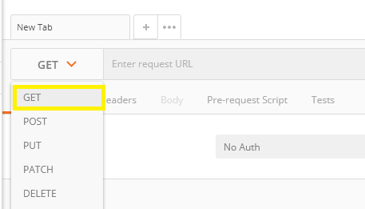
</p>

#### Ao lado digite:
```
localhost:8080/
```
<p align="center">
  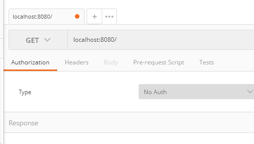
</p>

#### Clique no botão `Send` ao lado e veja só:
<p align="center">
  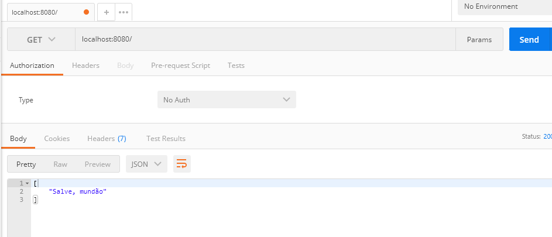
</p>

#### A mensagem que configuramos para aparecer... apareceu, ou seja, a `rota está ok`.

**Lembrando que a cada atualização no código, deve-se encerrar o servidor teclando `Ctrl C` e restartando novamente com o comando:**
```git
npm start
```
#### Até aqui vamos ver como deve estar nosso código no arquivo server.js e os arquivos da pasta do nosso projeto:
<p align="center">
  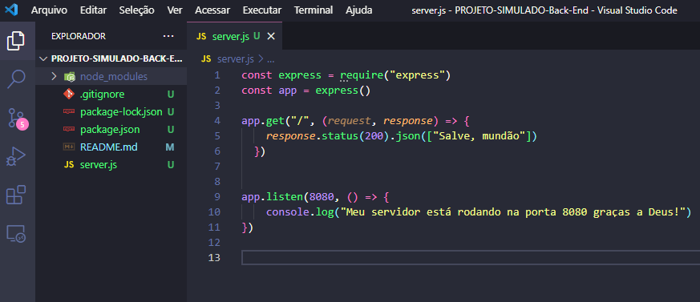
</p>

#### O código deve estar como está aqui, lógico que, se quiser mudar a mensagem fique á vontade. E em relação ao terminal, ele deverá estar assim por enquanto:
<p align="center">
  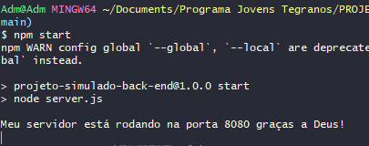
</p>


___
## `Dependências - Instalando o Nodemon`

#### Toda vez que atualizamos o código ou incluimos linhas de código, temos que matar nosso servidor (`Ctrl C`) e restartá-lo (`npm start`) novamente...  certo? Isso é chato! 
#### E existe uma `dependência` que nos ajuda nisso... chama-se `Nodemon`. Ele serve pra ficar restartando o nosso projeto(servidor) toda vez que ele encontra uma modificação.
#### digite o comando:
```git
npm install nodemon
```
#### ou
```git
npm i nodemon
```
#### A instalação pode demorar um pouco, mas vamos aguardar.
<p align="center">
  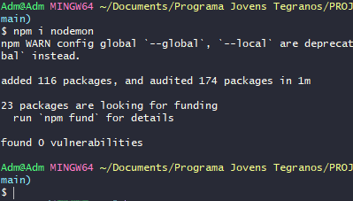
</p>

#### Pronto! Instalado! Se eu olhar no arquivo `package.json`, olha quem está lá!!!
<p align="center">
  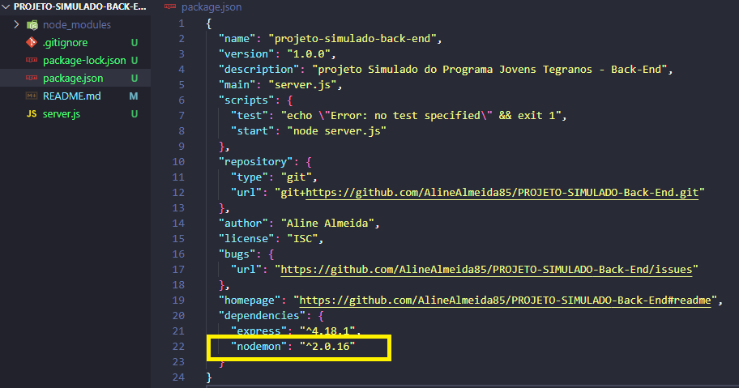
</p>

#### Agora vamos configurar: no mesmo arquivo (package.json) um pouco pra cima, no `start`, onde está escrito `node server.js` vamos alterar... ja que é aqui que configuramos a fomra de `startar` nosso projeto.
<p align="center">
  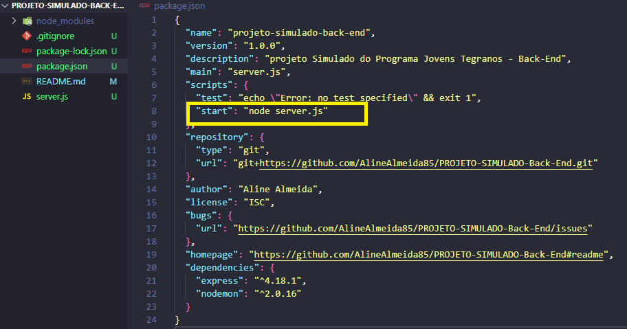
</p>

#### Vamos tirar o `node server.js` e escrever `nodemon server.js`.
<p align="center">
  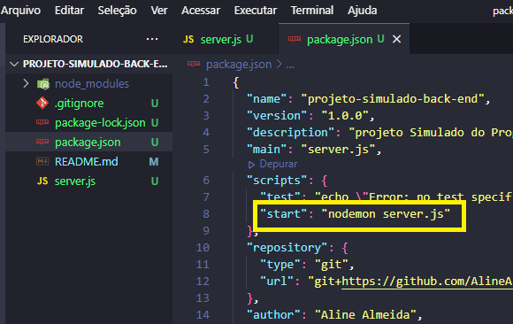
</p>

**Lembrando que para cada projeto que voce for criar, é necesário instalar todas as dependências que for necessário para o projeto funcionar**

####  qual será a diferença depois que eu tiver instalado o Nodemon?
#### se eu digitar o comando que estávamos usando antes:
```git
npm start
```
#### Veja o que acontece:
<p align="center">
  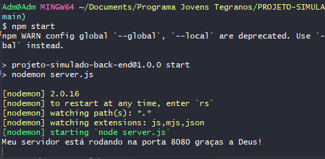
</p>

#### O servidor está rodando novamente, e a partir de agora, qualquer modificação no código, eu `não` preciso ficar `restartando`, ele fará isso sozinho. A única coisa que não podemos esquecer é que: vai desligar o computador... encerre o servidor com o mesmo comando de antes... `teclando Ctrl C`. E por que isso?? Porque senão, quando voce for usar a porta, ela estará em uso.


___
## `Criando uma rota real`
#### A partir de agora vamos dar continuidade criando uma rota real.
#### Crie uma pasta no seu projeto com o nome `data`, ela vai servir para colocar o arquivo .json que vamos usar para simular os dados de um banco de dados. Use o comando`
```git
mkdir data
```
#### Para criar a pasta e o comando:
```git
touch produtos.json
```
#### Para ccriar o arquivo com os dados para fazermos nossa suposição de dados.
<p align="center">
  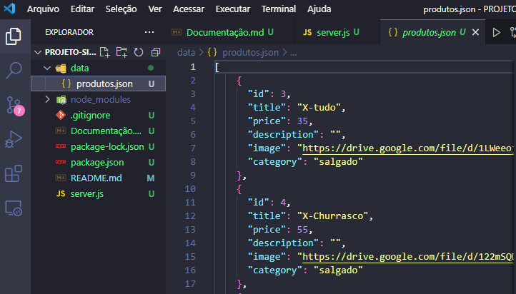
</p>

**Lembrando que no meu caso o `produtos.json`é o arquivo que usei para exemplo para a demonstração**
#### Vamos criar a rota vista anteriormente mas... retornando dados.
#### Começamos com o `app.get` seguido de uma rota `("/products")` seguida de uma arrow function `() => { }` com uma requisição e uma resposta `(request, response)`, e eu vou mandar entro dela uma `response.status(200)`.
```javascript
app.get("/products", (request, response) => {
  response.status(200)
})
```
#### Porém, agora preciso do arquivo que está dentro da pasta `data` (o arquivo `produtos.json`) criada anteriormente, e pra isso preciso importar pra dentro do meu arquivo esse outro arquivo, então,  no inicio do arquivo (`server.js`) vamos criar uma constante que será chamada de `produtosjson`, essa constante vai requerir la dentro da pasta `data`, o arquivo `produtos.json`, então dentro dos parênteses eu coloco aspas duplas `("./data)`, é dessa forma que estamos importando as informações que estão dentro do arquivo `produtos.json`, armazenados numa constante.
```javascript
const produtosjson = require("./data/produtos.json")
```
#### E o nosso código estará assim:
<p align="center">
  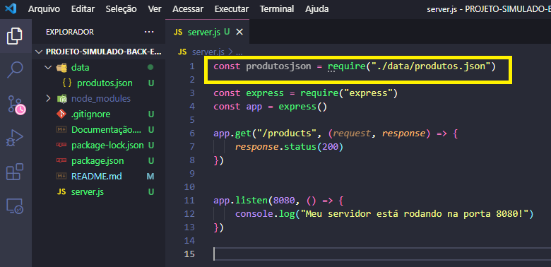
</p>

#### Resumindo: preciso importar os dados do arquivo onde está de fato os dados, então crio uma constante que recebe o arquivo. Simples!
**O `"./"` é porque o arquivo que eu quero não esta dentro da pasta que esta o arquivo do servidor.**
#### Até qui incluimos a resposta mas ainda não enviamos as informações, então vamos incluir o `.send(produtosjson)`. O código ficará assim:
```javascript
app.get("/products", (request, response) => {
    response.status(200).send(produtosjson)
})
```
#### Olha só o código todo:
<p align="center">
  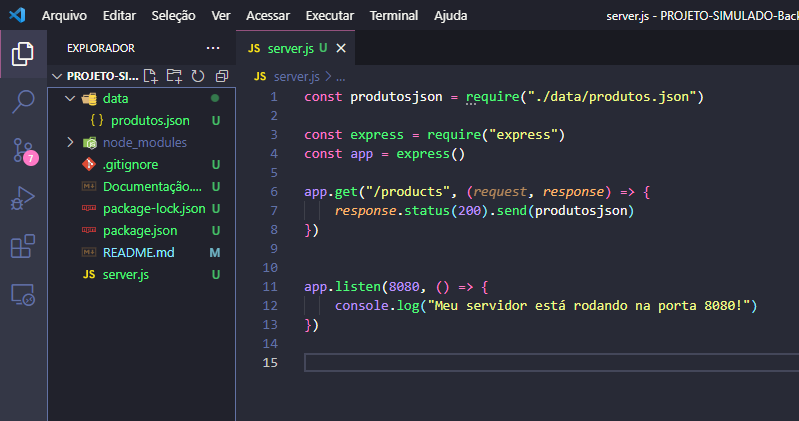
</p>

#### Agora vamos testar no `Postman`. Pois, como instalamos o `Nodemon`, não precisamos parar e restartar o servidor novamente, então, no `Postman`, escolha o método `GET` e escreva a rota como na foto abaixo:
<p align="center">
  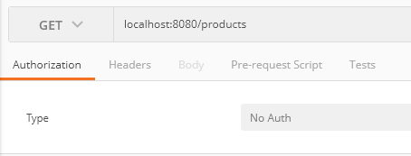
</p>

#### E olha só o resultado:
<p align="center">
  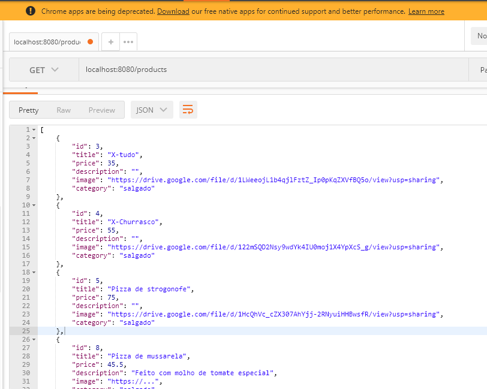
</p>

#### Tudo o que está no meu arquivo `produtos.json` apareceu no `Postman`, ou seja, a rota está funcionando.


___
## `Criando uma rota buscando pelo ID`
#### Pra isso teremos que usar alguns parâmetros. 
#### Mão na massa!
#### Começamos com o `app.get` seguido de uma rota `("/products/buscar/")` seguida de uma arrow function `() => { }` com uma requisição e uma resposta `(request, response)`. Agora, sempre que formos fazer uma pesquisa pelo `ID`, usamos como parametro o `path params` pois ele vai direto na rota. O código está assim:
```javascript
app.get("/products/buscar/:id", (request, response) => {

})
```
#### Agora eu quero fazer uma pesquisa e essa pesquisa tem que ser pelo ID, pra isso usamos o parâmetro enviado direto pela rota, então vamos recuperar o valor do ID enviado na request criando uma variável que vai receber esse id:
```javascript
let idRequest = request.params.id
```
#### Agora eremos que percorrer o arquivo json que esta com as informações.
#### Existe um método de array do javascript (chamado find) que é um método de busca, vamos dar pra ele o que queremos procurar e ele retorna com o resultado.
#### Vamos criar uma variável chamada `let produtoEncontrado` que vai receber a variável dos produtos `produtosjson` que dentro dela vai procurar com o método `.find()` onde vamos procurar o produto `(produto => )` cujo o `produto.id` seja igual ao `idRequest`
```javascript
let produtoEncontrado = produtosjson.find(produto => produto.id == idRequest)
```
#### É isso! A variável `produtoEncontrado` será o resultado de: procurar `.find` dentro desse array `produtosjson` o `produto.id` que seja igual `==` ao `idRequest`.
#### Vamos então fazer o response que será o mesmo ja visto antes:
```javascript
response.status(200).send(produtoEncontrado)
```
#### Agora vamos no Postman pra ver se deu certo:
#### Endereço da rota no Postman é `localhost:8080/products/buscar/8` porque no caso vou buscar pelo `ID 8`, e...
<p align="center">
  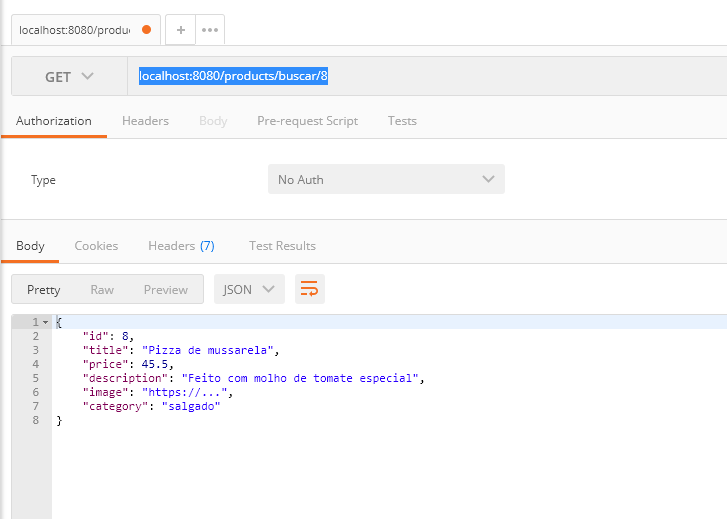
</p>

#### Apareceu o `ID` que eu busquei... está funcionando nossa segunda rota!!
