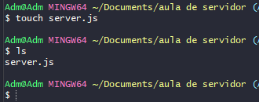
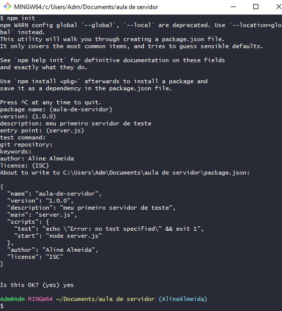
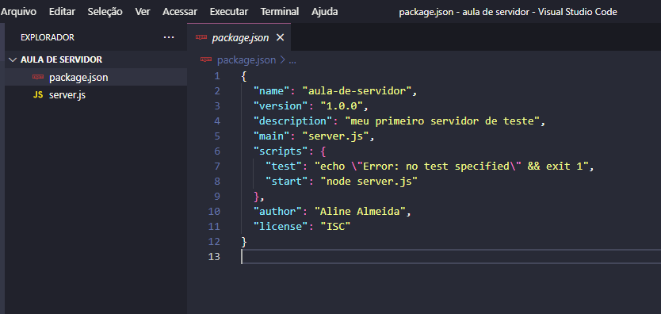

## ✔️ `Nosso Primeiro Servidor`
___
#### Existe um comando para iniciar um servidor dentro do Node.js. Mas primeiro abra o VSCode na pasta onde vai ser criado o servidor para acompanhar o progresso, digite:
```git
code .
```
#### Agora vamos criar nosso primeiro arquivo.
```git
touch server.js
```
#### Conforme a foto abaixo
<p align="center">
  
</p>

#### Perceba que digitei o comando acima e depois digitei 
```git
ls
```
#### para listar os itens que tem na pasta e apareceu o arquivo que acabei de criar com o nome `server.js`. Agora digite:
```git
npm init
```
#### Ele vai mostrar várias opções, seguem as descrições de cada uma:
___
```git
package name:
```
#### pode deixar com o nome sugerido mesmo. 
#### Aperte o **Enter**.
___
```git
version:
```
#### mantenha a versão.
#### Aperte o **Enter**.
___
```git
description:
```
#### Coloque por exemplo o nome do projeto acompanhado de uma breve descrição.
#### Aperte o **Enter**.
___
```git
entry point:
```
#### Onde começa a aplicação, que geralmente vai aparecer a sugestão.
#### Aperte o **Enter**.
___
```git
test command
```
#### Podemos colocar depois.
#### Aperte o **Enter**.
___
```git
git repository
```
#### Podemos colocar depois.
#### Aperte o **Enter**.

___
```git
keywords
```
#### Podemos colocar depois.
#### Aperte o **Enter**.

___
```git
author
```
#### Coloque o seu nome.
#### Aperte o **Enter**.
___
```git
licence: (ISC)
```
#### Deixe assim.
#### Aperte o **Enter**. E por fim irá aparecer uma pergunta:
```git
Is this OK? (yes)
```
#### Ele ja sugeriu a sua resposta
#### escreva `yes`
#### Aperte o **Enter**.
#### E pronto, foi criado. A foto abaixo mostra os passos acima.
<p align="center">
  
</p>

#### Vá até o `VSCode` e verifique que foi criado um arquivo chamado `package.json` com as informações que preenchemos:
<p align="center">
  
</p>

#### Neste arquivo podemos editar as informações contidas nele.
___
### Existe um outro comando para se fazer os passos acima, ele é mais fácil e rápido.
```git
npm init -y
```
#### Ele vai criar tudo de uma vez, podendo depois irmos até o arquivo `package.json` e editar as informações posteriormente.
___
### `Package.json`
#### O arquivo package.json é o ponto de partida de qualquer projeto Node.js. Ele é responsável por:
- Descrever o seu projeto.
- Informar a versão do Node e do npm.
- URL do repositório
- Versão do projeto
- Dependências de produção e de desenvolvimento. 
___

#### Agora veremos o que são `Dependências` no próximo tópico.