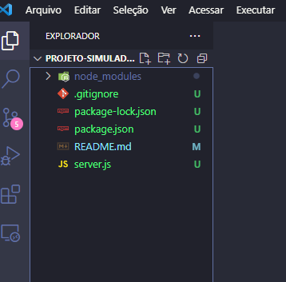

## ✔️ `Nosso Primeiro Servidor`
___
## `Iniciando o servidor`
#### Existe um comando para iniciar um servidor dentro do Node.js. Mas primeiro abra o VSCode na pasta onde vai ser criado o servidor para acompanhar o progresso, digite:
```git
code .
```
#### Agora vamos criar nosso primeiro arquivo.
```git
touch server.js
```
#### Conforme a foto abaixo
<p align="center">
  
</p>

#### Perceba que digitei o comando acima e depois digitei 
```git
ls
```
___
## `Iniciando o npm`
#### para listar os itens que tem na pasta e apareceu o arquivo que acabei de criar com o nome `server.js`. Agora digite:
```git
npm init
```
#### Ele vai mostrar várias opções, seguem as descrições de cada uma:
___
```git
package name:
```
#### pode deixar com o nome sugerido mesmo. 
#### Aperte o **Enter**.
___
```git
version:
```
#### mantenha a versão.
#### Aperte o **Enter**.
___
```git
description:
```
#### Coloque por exemplo o nome do projeto acompanhado de uma breve descrição.
#### Aperte o **Enter**.
___
```git
entry point:
```
#### Onde começa a aplicação, que geralmente vai aparecer a sugestão.
#### Aperte o **Enter**.
___
```git
test command:
```
#### Podemos colocar depois.
#### Aperte o **Enter**.
___
```git
git repositor:
```
#### Podemos colocar depois. Mas se voce criou um repositório no gitHub e iniciou o projeto a partir do clone, este item ja estará preenchido, então não precisa mexer.
#### Aperte o **Enter**.

___
```git
keywords:
```
#### Podemos colocar depois.
#### Aperte o **Enter**.

___
```git
author:
```
#### Coloque o seu nome.
#### Aperte o **Enter**.
___
```git
licence: (ISC)
```
#### Deixe assim.
#### Aperte o **Enter**. E por fim irá aparecer uma pergunta:
```git
Is this OK? (yes)
```
#### Ele ja sugeriu a sua resposta
#### escreva `yes`
#### Aperte o **Enter**.
#### E pronto, foi criado. A foto abaixo mostra os passos acima.
<p align="center">
  
</p>

#### Vá até o `VSCode` e verifique que foi criado um arquivo chamado `package.json` com as informações que preenchemos:
<p align="center">
  
</p>

#### Neste arquivo podemos editar as informações contidas nele.
___
## `Iniciando o npm de outra forma`
### Existe um outro comando para se fazer os passos acima, ele é mais fácil e rápido.
```git
npm init -y
```
#### Ele vai criar tudo de uma vez, podendo depois irmos até o arquivo `package.json` e editar as informações posteriormente.
___
### `Package.json`
#### O arquivo package.json é o ponto de partida de qualquer projeto Node.js. Ele é responsável por:
- Descrever o seu projeto.
- Informar a versão do Node e do npm.
- URL do repositório
- Versão do projeto
- Dependências de produção e de desenvolvimento. 
___
#### Agora veremos o que são `Dependências` no próximo tópico.

___
## `Dependências - Instalando o Express`
#### Continuando no nosso terminal, digite:
```git
npm install express
```
#### Vá no `VSCode` e perceba que foram criados mais dois arquivos: o `package-lock.json` e a pasta `node_modules`.
___
## `.gitignore`
#### Agora digite:
```git
touch .gitignore
```
#### Para criar o arquivo `.gitignore`.
___
## `Chamando o Express no arquivo`
#### Na sequência, vá no arquivo `server.js` para chamarmos o `Express`.
#### Digite:
```javascript
const express = require("express")
```
#### Aqui estamos requisitando o `Express` pro meu arquivo criando uma `constante`(variável) com o nome `express` que vai receber uma função chamada `require("express")` que chamará o `express`.
___
## `Executando o Express no arquivo`
#### Agora precisamos executar o `Express`, por dentro, ele é uma grande função. Para executar ele faremos:
```javascript
const app = express()
```
#### Ou seja, aqui estamos executando o `Express` criando outra `constante` com o nome `app` que irá receber a função `express()` guardando ele na variável `app`.
___
## `Criando a Porta`
#### Agora vamos criar a porta. Chamamos o `app`, `.listen` essa `função listen` é do `Express`, crio uma função `()` e vou configurar uma porta `(8080)`, abrindo uma arrow function `() =>{ }` que vai executar a mensagem `console.log("Meu servidor está rodando na porta 8080 graças a Deus!")`
```javascript
app.listen(8080, () => {
  console.log("Meu servidor está rodando na porta 8080 graças a Deus!")
})
```
**Use sempre portas acima do número 3000, pois o que tem abaixo ja está sendo usado pelo seu computador**

#### Agora vamos rodar pra ver se deu tudo certo até aqui.
___
## `Testando o Servidor`
#### no seu terminal digite:
```git
npm start
```
#### Que se voce for no arquivo `package.json`, perceberá que nos `scripts` há o comando `start` que está definido como `"node server.js"`, ou seja, digitar o comando acima é o mesmo que digitar o que está no arquivo como mostra na foto abaixo:
<p align="center">
  
</p>

#### E olha só o que aparecerá no terminal:
<p align="center">
  
</p>

#### Apareceu a mensagem do console, ou seja, seu servidor está funcionando!
**Lembrando que até aqui só `construimos um servidor`, ainda `não é uma API`, pois ainda faltam as rotas.**
#### Agora vamos criar nosso primeiro `GET.`
___
## `Criando o GET`
#### Vamos configurar a primeira rota. Existe uma função pra construir o `GET`. Mas antes disso vamos nos certificar que estamos com os arquivos que devemos estar até aqui.
<p align="center">
  
</p>

#### Como na foto acima devem ter estes arquivos no seu projeto.
#### Agora sim vamos partir para a primeira rota.
#### O `app.get` pois dentro do `Express` ja exite essa função `get` pronta e sempre que formos criar um `GET`, `POST`, `PUT`, `PATCH` ou `DELETE`, no primeiro parâmetro da função será a minha rota `("/")`, no segundo parâmetro será uma função `("/", ())` que vai receber o request e o response `(request, response)`, seguido de uma arrow function ` => ` e dentro dela será o que vai acontecer.
```javascript
app.get("/", (request, response) => {

})
```
#### Essa é a estrutura básica de uma requisição `get`. Então a `função get` espera que eu mande uma `rota`, e ela me retorna uma `outra função` (`callback`), e sempre vai me enviar uma `request` e uma `response`, porque são o que eu `preciso` pra fazer um `get`.
#### Aqui será onde vão acontecer as requisições(`request`), e se tem requisição eu vou enviar uma resposta, e nós como `Back-Ends` vamos configurar uma resposta(`response`) e pra fazer isso vamos fazer uma `response`, vou enviar um `.status`, colocando o número dele `(200)` pois é uma resposta positiva que queremos e vou mandar um `.json` falando `(["Salve, mundão"])`.
```javascript
app.get("/", (request, response) => {
  response.status(200).json(["Salve, mundão"])
})
```
#### Pronto! Criada a primeira rota. Agora vamos testar essa rota. Para `parar` o servidor, tecle `Ctrl C`.
___
## `Testando a rota`
#### Inicie o servidor novamente digitando:
```git
npm start
```
#### 