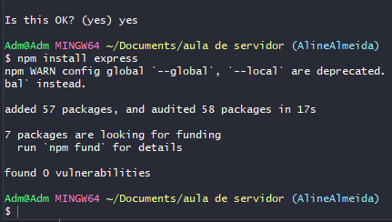
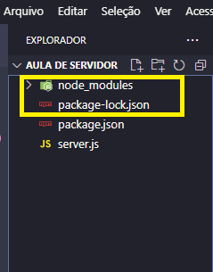
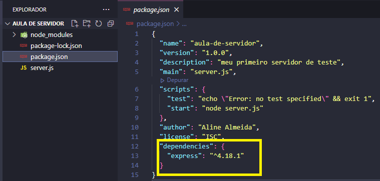

## ✔️ `Dependências`
___
### São ferramentas que usamos pra construir nosso projeto.
#### Quando estamos trabalhando com o Node.js, existem vários pacotinhos que podemos usar com códigos prontos, ferramentas desenvolvidas por outros desenvolvedores.
#### As dependências são gigantescas e podemos instalar no nosso projeto.
___
### Primeira Dependência: [Express]().
#### A forma mais mínimalista que existe de construir `APIs` com `Node.js`. Iremos utilizar esse framework.
#### Utilizamos ele pra construir o GET, para pegar as respostas, pra criar nosso servidor.Vamos baixar ele agora. Continuando no nosso terminal, digite:
```git
npm install express
```
#### Após a intalação o terminal retorna assim:
<p align="center">
  
</p>

#### Vá no VSCode e perceba que foram criados mais dois arquivos: o `package-lock.json` e a pasta `node_modules`.
<p align="center">
  
</p>

#### Além do que o arquivo package.json foi editado.
<p align="center">
  
</p>

#### Note bem o que apareceu. Um item `dependencies` e o `express` dentro dela.
#### E o que é a `node_modules`? 
#### Resposta: Na `node_modules` estarão baixadas as `dependências` que o seus pacotes precisarão para funcionar. E as `dependências` das `dependências` também.

#### E o que é o `package-lock.json`? 
#### Resposta: O `package-lock.json` especifica a versão e suas dependências próprias, assim, a instalação criada será sempre a mesma, toda vez.
#### Sempre que você instalar um pacote do `npm`, ele será referenciado no `package-lock.json` e será `instalado` na pasta `node_modules`.