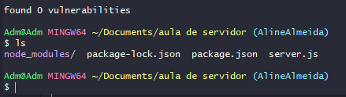
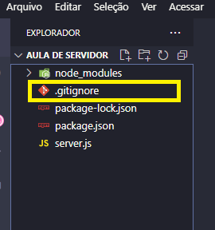
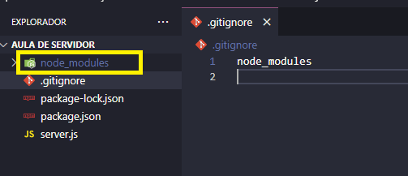

## ✔️ `.gitignore`
___
### Nós `ignoramos` a `node_modules` pois nela estão todos os downloads de todas as dependências do projeto, fica MUITO pesado subir ela no git, por exemplo.
#### Obs:
**Se apagarmos ela só precisamos dar o comando npm install que as dependências serão baixadas de novo e pasta node_modules reaparecerá.**
#### O npm sabe quais dependências baixar pois elas estão referenciadas no package.json e no package-lock.json.
___
#### Vamos lidar com ela:
#### Na pasta raiz do seu projeto crie um novo documento. Voce pode criar manualmente ou pela pasta.
#### Digite o comando
```git
ls
```
#### Para listar tudo o que voce tem na pasta do seu projeto.
<p align="center">
  
</p>

#### Veja que temos os arquivos citados nessa aula.
#### Agora digite:
```git
touch .gitignore
```
#### Para criar o arquivo .gitignore, agora veja que o arquivo foi criado
<p align="center">
  
</p>

#### Continuando no VSCode, abra o arquivo criado e digite dentro dele o nome do arquivo ou pasta que quer ignorar, que no caso é a `node_modules`.
<p align="center">
  
</p>

#### E perceba que o arquivo `node_modules` mudou o tom de cor, ou seja, ele foi ignorado e quando formos subir nosso projeto para o GitHub ela não vai junto, será realmente ignorada.
#### Todos os outros arquivos que precisarem ser ignorados é só seguir o mesmo procedimento.
